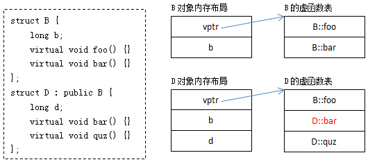
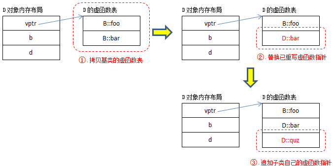
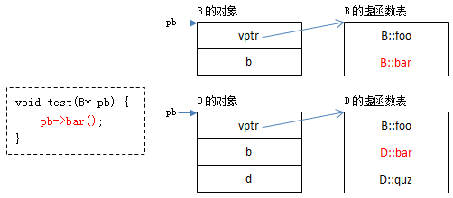
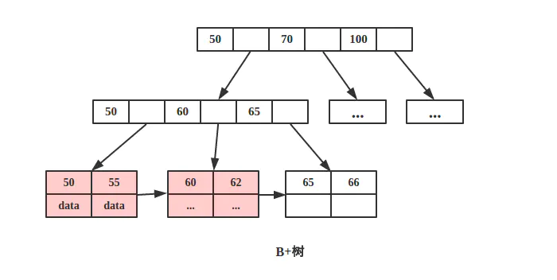
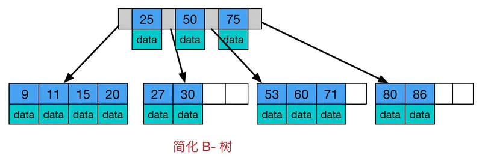

### 1. 动态多态和静态多态

1.  静态多态：也成为编译期多态，通过函数的重载实现。以不同的参数列表来实现不同函数的调用。
2.  动态多态：也成为运行期多态，通过虚函数和继承体系实现，指向父类的指针或引用可以指向子类对象，而调用虚函数时也会执行子类的版本。

### 2. 虚函数的实现

​	虚函数通过虚表和虚表指针实现。每一个声明了虚函数的类，都会有一个虚表，里面存放着虚函数的地址，每个对象都带有一个虚表指针，通过虚表指针来调用函数。若子类重写了父类定义的某个虚函数，那么相应的，子类的虚表会将这个函数放进原来的位置。也就是说，子类和父类的同一个虚函数在虚表中的偏移量相同。这个虚表指针就像是一个身份牌，用来标识某个指针所指向的对象的类型。通过虚表和虚表指针，类型为父类的指针或引用，在指向子类对象时，可以调用子类版本的虚函数，从而实现多态。

      

### 3. 类内存在多个虚表指针

​	当一个类继承自多个父类，且这多个父类都具有虚函数时，子类对象内会有多个虚表指针，但实现原理是一样的。

### 4. C++11

1.  auto关键字：自动推断变量类型，例如容器的迭代器，可以省去繁杂的变量声明。

2.  decltype：获取表达式的类型，与auto不同的是，auto只能对变量使用。

    ```c++
    decltype(x)  y=func();
    // 自动推断y的类型为x，x也可以替换为某个表达式
    ```

3.  尾置返回类型：即在函数参数列表后指明它的返回类型，而不是在最左边：

    ```c++
    template<typename T,typename U>
    auto func(T x,U y) ->decltype(x+y){
        return x+y;
    }
    //像这样的无法直接写出返回类型的函数，就可用这种方式声明
    ```

4.  base range for：

    ```c++
    vector<int> vec;
    for(int x:vec){
        ...
    }
    //更加便捷的编程方式
    //适用于 1. 数组   2. 定义了begin和end
    // 如果要修改数组中的内容，加上&即可，例如 for(int & x:vec)
    ```

5.  列表初始化：

    ```c++
    vector<int> vec={1,2,3,4,5};
    //允许构造函数或其它函数像使用参数那样使用初始化列表
    ```

6.  lamba函数：匿名函数，也可为其命名并用auto关键字修饰

7.  nullptr：c++11中加入nullptr关键字取代C的NULL，原因是C的NULL宏定义为 (void*)0，而C++存在函数重载：

    ```c++
    void func(int x);
    void func(Char* x);
    //C++不允许将0转换为char*，因此会选择第一个函数进行匹配
    ```

8.  noexcept：新关键字，表明函数不会抛出异常，而如果发生异常，程序会终止

9.  完美转发： std::forward<T>(u)有两个参数：T与 u。 a. 当T为左值引用类型时，u将被转换为T类型的左值； b. 否则u将被转换为T类型右值。 

10.  左值右值：可以取地址的、在等号左边的值就是左值；无法取地址的，在等号右边的值就是右值；但注意，无论是左值引用还是右值引用，它们本身都是个左值。Tips：const 左值引用可以指向右值，但不能修改被指向的值。

	### 5. share_ptr 是线程安全的吗

​	如果有多个线程对同一个shareptr对象进行读写操作，那么需要加锁。因为有可能线程A正在读取对象X，然后读到一半线程B写了对象X，此时线程A读了一半，有可能读到的那个指针已经被线程B改写了，因此不是线程安全的。
详细：https://blog.csdn.net/liang19890820/article/details/120465794

### 6. 构造函数能否虚化

​	虚函数的调用需要对象内的虚表指针，构造函数执行时对象还没构造，并未分配属于自己的内存空间，所以当然无法调用虚函数了。

### 7. 禁止或限制对象在heap上

​	禁止：将operator new等函数声明为private。 限制：将析构函数声明为protect，再在public域内声明一个与析构函数功能相同的函数。

### 8. B树与B+树的区别

​	 B+树非叶子节点不存储数据，所有数据均存放在叶子节点，而B树的每个节点都带有数据。这样一来B+树的每次查询时间都稳定是O(logn)。B+树这样做的好处就是，非叶子节点不携带数据，则每一次磁盘IO可以读取更多的树节点，因而非叶子节点的阶数可以比B树多很多，反而降低了树的高度。
    

### 9. 虚函数表建立的时间和位置

虚函数表在程序编译阶段被构建起来，在编译期获取虚函数的地址，并且这一组地址在运行期不可改变。虚函数表存放在类定义模块数据段的全局区域或静态数据区