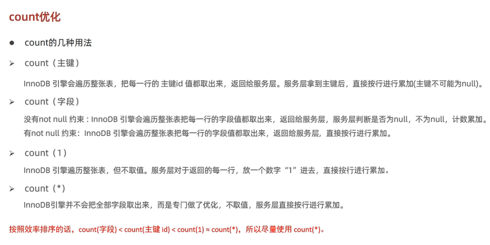

### 一、插入优化

1. 批量插入：有多条数据时，批量插入效率由于逐条插入

 	2. 手动提交事务：尽量开启手动提交事务
 	3. 主键顺序插入：插入的数据尽量按照主键顺序插入，例如主键id为 1，3，8这样的顺序插入
 	4. 大批量插入数据：使用mysql的load命令比insert高效
     1.  客户端连接服务器时加上参数：--local-infile
     2.  设置全局参数local_infile为1，开启从本地加载文件导入数据的开关：set global local_infile=1
     3.  执行load加载数据：load data local infile <filepath>  into table <tablename> fields terminated by ',' line terminated by '\n';    其中，   fields terminated by ',' 表示字段用逗号隔开，line terminated by '\n'表示不同行用换行符隔开

### 二、主键优化

​	在设计表的主键时，有以下几个设计原则

1.  在满足业务需求的前提下，尽量降低主键长度。因为二级索引的叶子节点附带对应的主键
2.  在插入数据时，尽量按主键顺序插入，选择使用AUTO_INCREMENT自增主键，因为如果不是顺序插入，容易产生页分裂现象。
3.  尽量不要使用UUID做主键或是其它自然主键，如身份证号，因为这样的主键大多是无序的。
4.  业务操作时避免对主键的修改。

### 三、Order by优化

​	在使用ORDER BY语句时，如果排序的字段没有创建索引或创建了但由于其它原因而没有使用索引时，排序将会在排序缓冲区(sort buffer)完成，这个过程为首先读取满足条件的行，然后在缓冲区中对其进行排序，将排序结果返回。这样一来排序的效率将非常慢，优化手段如下：

1.  根据排序字段建立索引，多字段排序时，也遵循最左前缀法则。(例如要对age  phone字段进行排序，创建索引的顺序为 aeg、phone，如果写了ORDER BY phone，age，就破坏了最左前缀法则，此时将在缓冲区内排序)
2.  尽量使用覆盖索引。如果select中的字段跟创建索引的字段不同时，将走缓冲区排序
3.  多个字段排序，如果一个升序一个降序时，要注意创建联合索引时使用填入对应的规则(ASC/DESC)。(例如创建 age、phone的联合索引时，默认二者都是升序排序，如果在ORDER BY 语句中一个升序一个降序，将不会使用索引，解决方法为在创建联合索引时指定为降序)
4.  如果不可避免地会出现filesort，而且数据量比较大时，可以适当增大排序缓冲区的大小(sort_buffer_size)，因为如果排序缓冲区不够存放数据，将在磁盘文件中完成排序，效率会更低。

### 四、Group by 优化

1. 分组操作时，如果操作的字段有创建索引，将可以省去临时表，提高效率

 	2. 分组操作时，索引的使用也是要满足最左前缀法则的。

### 五、Limit优化

### 六、Count优化

### 七、Update优化

