## 一、SQL通用语法

## 二、DDL

​	DDL是SQL中用来定义数据的语言，可以用来操作数据库、表、字段等。

### 2.1 数据库操作

### 2.2 表操作

​	1. 表的创建：

2.  查询：

    其中第三种方法相对于第二种，能够获得更加详细的信息。

3.  修改：

    1.  添加字段： ALTER TABLE + 表名 + ADD + 字段名 + 类型(长度) [comment 注释]
    2.  修改字段数据类型： ALTER TABLE + 表名 + 字段名 + 新数据类型(长度)；
    3.  修改字段名和表名：ALTER TABLE + 表名 + CHANGE + 旧字段名 + 新字段名 + 类型(长度) [comment 注释]
    4.  删除字段：ALTER TABLE + 表名 + DROP + 字段名
    5.  修改表名：ALTER TABLE + 表名 + RENAME TO + 新表名
    6.  删除表：DROP TABLE + 表名  /    TRUNCATE TABLE + 表名  （第二种方法的特殊之处在于它会删除指定表并重新创建该表）

### 2.3 表中涉及的数据类型

1.  数值类型：

    ​	在命令行中输入时一律不用区分大小写，如果需要的是无符号数，则在后面加上unsigned即可，例如 int unsigned。double和decimal都可带参数，用于描述数字长度与小数点后精确到几位。

2.  字符串类型：

    ​	char类型不可变长，但性能好，varchar类型可以根据实际情况使用更少的空间，但要先计算所需长度，能一定程度上节省空间，但同时性能不如char。

3.  日期类型：

## 三、DML

​	DML是一种数据操作语言，用来对数据库表中的数据进行修改。

### 3.1 插入

​	

### 3.2 修改

​	where条件是用来指定要修改哪条数据，如果没有将修改所有数据，而条件是要修改的数据的其它字段，例如要修改id=1的那条数据中的name字段，where后的条件就可以写为id=1(注意只有一个等于号)

### 3.3 删除

​	

​	where后的条件用来指定要删除的某几条数据，不加就全都删除。注意delete不能删除某个字段，要删除某个字段，要用修改的方式，将对应的字段修改为NULL即可

## 四、DQL

​	DQL是数据查询语言，用来查找数据库中表的记录。

### 4.1 基本查询：

### 4.2 条件查询

​	

1.  between 后加的是最小值，and后加的是最大值，这个区间是左右闭区间
2.  in后加一个括号，例如 age in (10，20，40)，意思是只要年龄是10、20或40都可   
3.  like用来做模糊匹配，例如想找名字是两个字的数据，就写 name like ('__')，下划线代表单个字符，两个下划线就代表任意两个字符组成的数据。而百分号代表任意个字符，如果想查找身份证号最后一位是X的数据，就写 id like('%x')即可
4.  is null用来查找空数据，要查找非空数据就写 is not null

### 4.3 聚合函数

​	聚合函数是对表中一整列数据进行操作的函数，包括最大、最小、求平均值等

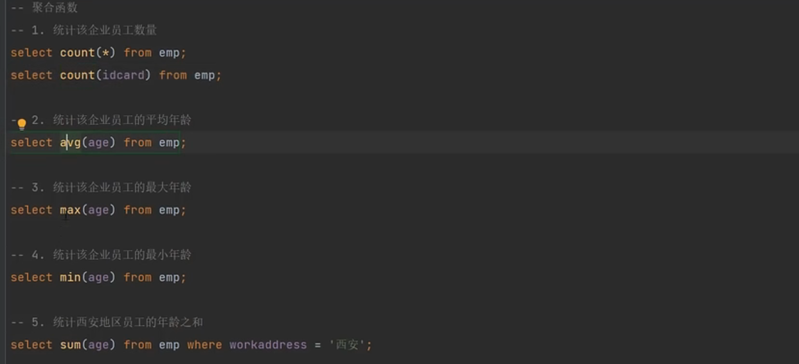

### 4.4 分组查询

 分组查询与条件查询不同的是，它可以使用聚合函数的结果来进行过滤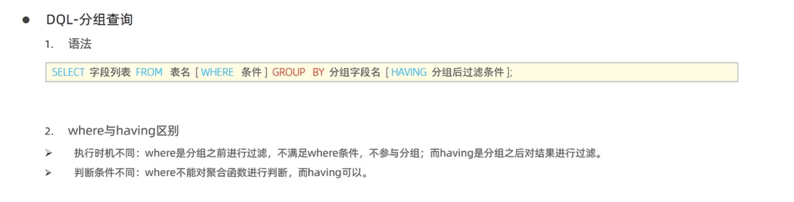

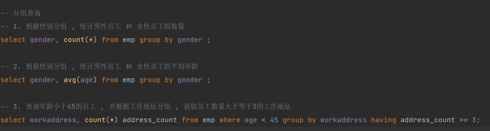

需要注意的是：1. 执行顺序上 where>聚合函数>having  2. 分组之后，查询的字段一般为分组字段和聚合函数，查询其它字段毫无意义

### 4.5 排序查询

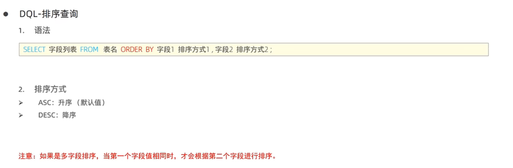

### 4.6 分页查询

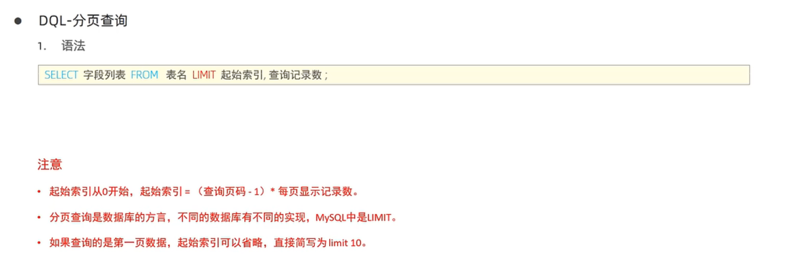

### 4.7 DQL的编写顺序与执行顺序

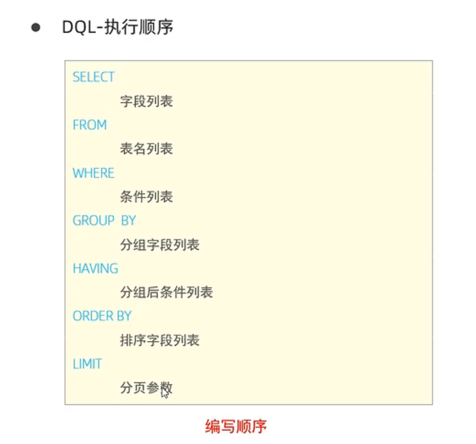

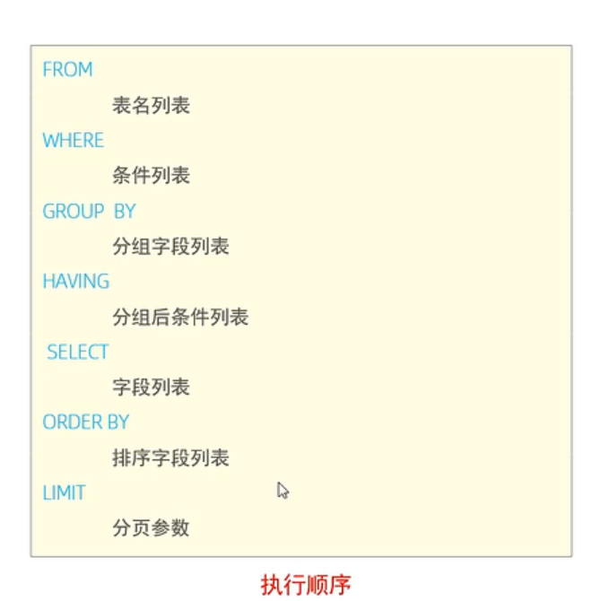

## 五、DCL

​	DCL是一种数据控制语言，用于创建数据库用户、控制不同用户对数据库的不同访问权限

### 5.1  管理用户

​	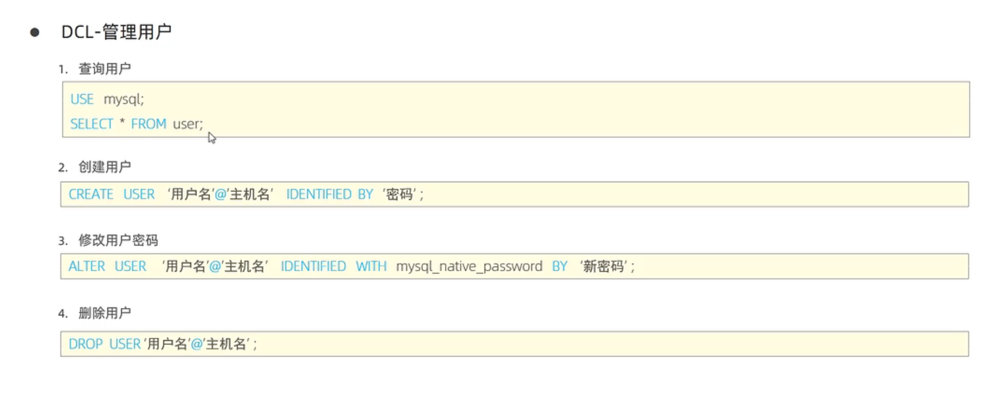

​	要创建一个任意主机上的用户时，只需要将主机名用通配符%代替即可，数据库中的用户信息都储存在mysql数据库中的user表。

### 5.2 设置权限

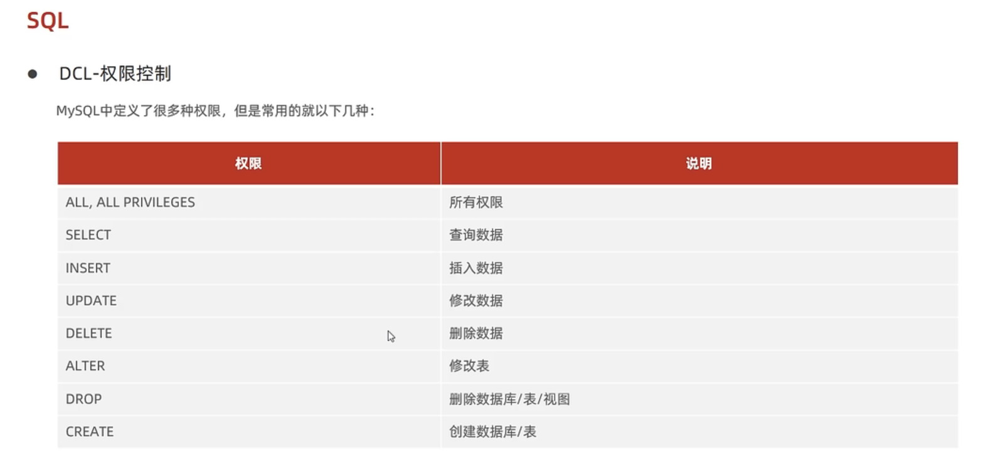

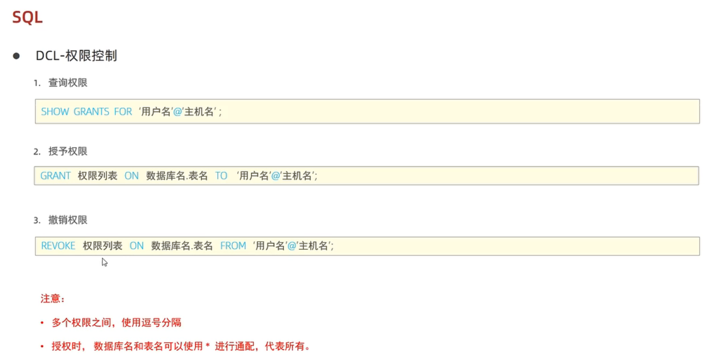

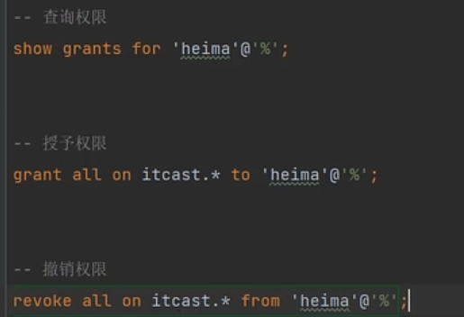

