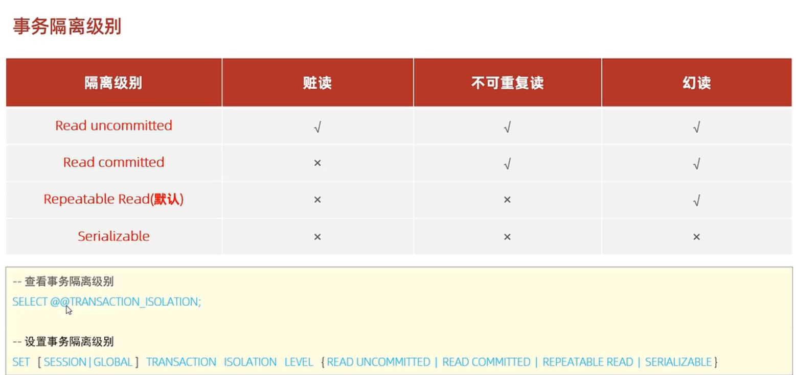

## 一、简介

​	事务是指一系列操作的集合，是一个不可分割的单位。事务会把所有的操作作为一个整体向系统提交或撤销，这些操作**要么同时成功，要么同时失败**。默认MySql的事务是自动提交的，也就是说，当执行一条DML语句，MySql会立即隐式地提交数据。

## 二、操作事务

### 2.1 设置为手动提交事物

​	mysql中都是默认自动提交事务，所以要想把几个操作打包成事务，得先开启手动提交事务，有两种方法：

1.  set @@autocommit=0 ;  autocommit=1时代表自动提交事务，因此将其设置为0就变成手动提交事务。
2.  start transaction：这条命令可以使得后续的操作都需要手动提交事务。
3.  begin：与2相似

### 2.2 手动提交事务与回滚事务

​	当事务中的操作都没有异常时，命令commit可以提交事务，在事务提交前，对应的表的数据不会发生改动。当事务中某个操作抛出异常，使用命令rollback进行操作回滚，消除前面的没有异常抛出的几个操作。

## 三、事务四大特性

## 四、并发事务问题及事务隔离

### 4.1 并发事务问题

### 4.2 事务隔离等级

	越往下隔离等级越高，同时效率也越低，最后一种隔离用了锁来避免并发问题。