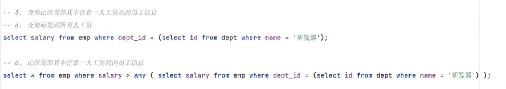

### 一、多表关系

​	多表关系包括一对多、多对多、一对一

1.  一对多关系：例如一个部门对应多个员工，但一个员工只对应一个部门

2.  多对多关系：例如多个学生与多门课程，一个学生可以选修多门课程，一门课程也可以被多名学生选择

3.  一对一关系：多用于但表拆分

### 二、多表查询概述及方式

​	多表查询，即从多张表中查询数据，在多表查询中容易出现笛卡尔积现象(即A集合和B集合的所有组合情况)。
多表查询分为以下几种类型：

### 三、内连接

​	在显式内连接中，on后加的条件与隐式内连接中where后加的条件的性质一致，通常给表起别名来简化命令，但注意起了别名后就只能使用别名了。

### 四、外连接

注：左外连接与右外连接之间可以相互转换，只需要将left改为right，然后将要全部查询的表放到join的右边即可

### 五、自连接

自连接用于查询一张表中的不同字段，这些字段之间互相关联，注意虽然只有一张表，但需要起别名

### 六、子查询

​	即将一次查询结果给另一个命令使用：括号里的查询语句就叫子查询，按照子查询的结果可以将子查询分为四类，其中标量是指查询出来的结果是单个值，例如查找表中名为Tom的员工的部门id，那么返回的就是单个值。而在这之后，将这单个值作为条件，可以进一步查询

#### 6.1 列子查询

​	即查询结果为一列数据：注意操作符跟在子查询之前

