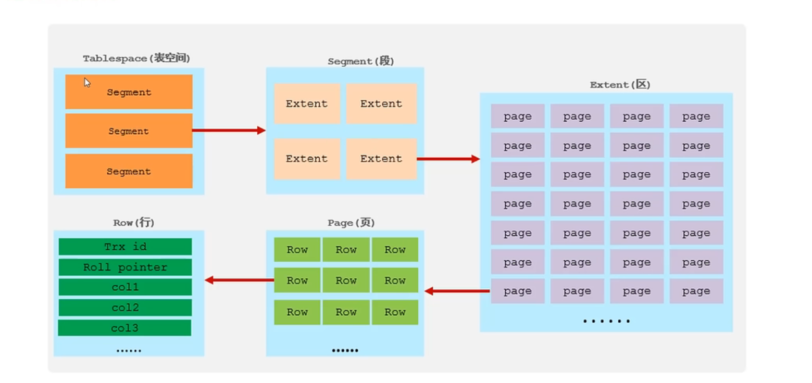
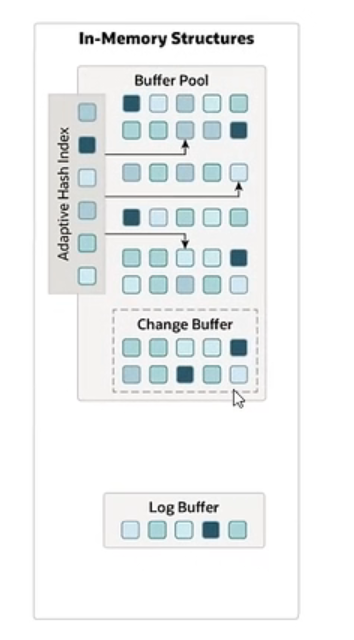
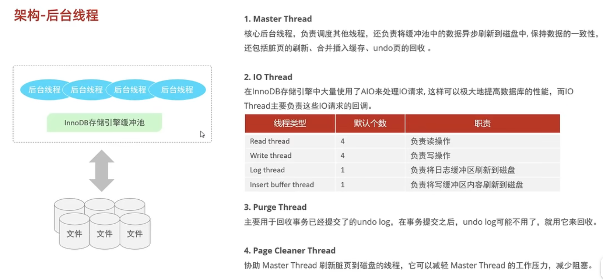
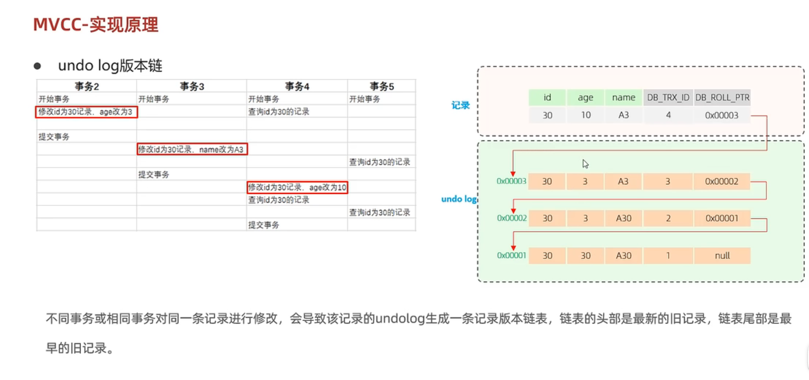
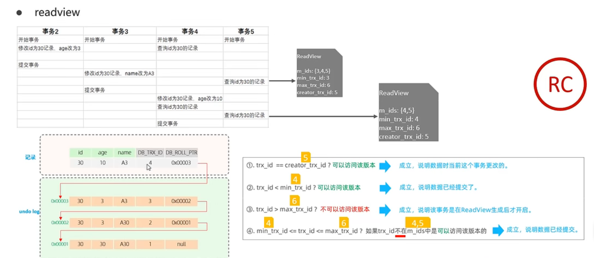

### 一、定义

​	存储引擎就是数据库存储数据、建立索引、更新/查询数据等技术的实现方式。存储引擎是基于表的，而不是基于库的，也就是说在创建表时可以为其指定存储引擎(默认是Innodb)，因此存储引擎也被称为表类型。

### 二、创建表时指定存储引擎

​	

​	关键字ENGINE指定存储引擎。

### 三、索引引擎之间的区别

### 四、存储引擎的选择

​	适用MEMORY引擎的场景现在已经大多数被Redis数据库替代。

### 五、InnoDB存储引擎架构

#### 5.1 逻辑存储架构

​	InnoDB引擎中，数据库的每个表都会在磁盘中保存为.idb文件。如下图所示，每个表空间中存储着多个段，段结构分为索引段、数据段、回滚段。由于mysql是靠索引来查询的，因此**索引段存储的是B+树的非叶子节点、数据段存储的是B+树的叶子节点**，每个段中又分为多个区，默认情况下每个区大小为1M，每个区中又分为多个页，innoDB引擎中，**每个页的大小为16KB**，因此每个区存储了64个连续的页。
​	在页中，存储的是一行行的数据，其单位是ROW，每个ROW对应表中一行数据，一行数据由多个列组成。值得注意的是，其中有两个隐藏成员：Trx_id和Roll_pointer，Trx_id为最后一次更改的记录的id，而Roll_pointer为指针，指向最后一次修改的记录修改之前的数据。

	

#### 5.2 内存结构

 	1. buffer poll：缓存池是mysql为了减少磁盘IO的一种措施，里面缓存的是在磁盘上经常操作的数据。在对数据进行增删查改时，先操纵缓存池中的数据(如果不存在于缓存池，则从磁盘中加载出来)，然后再按一定的频率将缓存池中内容同步刷新到磁盘中。缓存池存储的单位是页，包括三种：
            	1. free page：空闲页，未被使用
            	2. clean page：未被修改的数据页
            	3. dirty page：已被修改的数据页
	2. change buffer：change buffer是buffer poll中的一个部分，当客户端要更改数据库中的某个数据，而这个数据不在缓存而是在磁盘中时，就会将更新记录在change buffer中，而不需要从磁盘里取出数据页。当下一次查询操作命中这个数据页的时候，会将对应的数据页从磁盘中取出，然后更新数据页。
	3. Adaptive hash index：自适应哈希索引，用于优化innoDB对buffer pool数据的查询。无需人工干预，系统根据情况完成。
	4. Log buffer：日志缓冲区，用于缓存要写入磁盘中的log日志数据(redolog、undolog)。

#### 5.3 后台线程

​	

#### 5.4 日志

1. undolog：原子性是事务四大特性之一，要保证事务的原子性(要么全部成功要么回滚)就得依靠undolog。undolog根据事务的内容记录，例如事务中有insert，undolog中就记录delete，事务中有update，undolog就记录相对应的能回滚的update。   在数据修改前，undolog会先被写入磁盘，如果事务提交以及写入磁盘的过程发生异常，就可以根据undolog将数据库恢复到事务提交前的状态。

 	2. redolog：redolog用于实现事务的持久性，即成功提交的事务对数据库中数据的修改是永久性的。redolog中记录了对数据的修改，在修改数据库时，不会直接操作磁盘中的页，而是会先修改buffer poll中的页，并记录为脏页，此时缓存中的数据与磁盘中的数据就不一致，如果服务器宕机再重启，所做的修改还没来得及同步到磁盘中，就会丢失，而redolog会记录这些修改，有了redolog就能防止这种情况发生。
           redolog由两部分组成，一个是位于缓存中的redo buffer，一个是位于内存中的redo logfile，因此redo log记录修改时也不是直接写入磁盘文件，而是先记录在缓存中，但redo log的持久化会先于数据的持久化。

### 六、MVCC

​	MVCC又称多版本并发控制，用于维护数据库中一条数据的多个版本，使得读写操作没有冲突，MVCC的实现需要利用：1. 数据库中数据的三个隐藏字段   2. undolog   3. readview

#### 6.1 隐藏字段

​	数据库在存储时除了会创建用户指定的字段，还会加上2~3个隐藏字段：

1.  DB_TRX_ID：记录上一个修改本条数据的事务id。
2.  DB_ROLL_PTR：回滚指针，指向这条记录的上一个版本，配合undolog使用
3.  DB_ROW_ID：当没有为表指定主键字段时，自动添加该隐藏字段作为主键字段。

#### 6.2 undolog版本链

​	如果有多个操作修改同一记录，在undolog中会针对这多个修改进行记录，而依靠隐藏字段DB_ROLL_PTR，这些记录会形成链表：

#### 6.3 readview

​	readview是快照读时，MVCC提取数据的依据(即根据readview来决定选取undolog版本链中的哪个版本)。它包含以下四个关键字段：

1.  m_ids:   当前活跃事务的id集合,例如当前是事务5，但是事务3、4还没提交，这个集合就是{3,4,5}
2.  min_trx_id:  当前最小活跃事务id，以第一点的情况，这个id就是3，如果3提交了，那就是4
3.  max_trx_id: 预分配事务id，即当前最大活跃事务id+1，以1的情况就是5+1=6
4.  creator_trx_id: readview创建者的事务id

其选取数据的规则如下：trx_id是某个版本的数据的DB_TRX_ID(即修改这个数据的事务id)

1.  trx_id=creator_id：可以访问该版本，因为创建视图的事务跟修改数据的事务是同一个
2.  trx_id<min_trx_id：可以访问该版本，因为trx_id<min_trx_id说明这个版本修改它的事务已提交
3.  trx_id>max_trx_id：不可访问该版本，因为trx_id>max_trx_id说明修改数据的事务是在readview之后创建
4.  min_trx_id<=trx_id<=max_trx_id：只要trx_id不在m_ids中就可以访问

不同隔离级别生成readview的时机不同：**READ COMMITTED级别：每次快照读都将生成一份readview，REPEATABLE READ级别：仅在事务第一次快照读时生成readview，后面的都使用这个readview**

#### 6.4 案例

事务五中的快照读：先选取最后的版本，即还没在undolog中的版本，它的DB_TRX_ID为4，第一次快照读创建的readview如图所示，4作为trx_id,按照这些条件进行匹配，发现均不匹配，于是进而去undolog中寻找前一个版本，trx_id=3，然后再按照条件去判断，也均不符合，于是再往前，找到trx_id=2时，其符合第二个条件，于是使用这个版本。