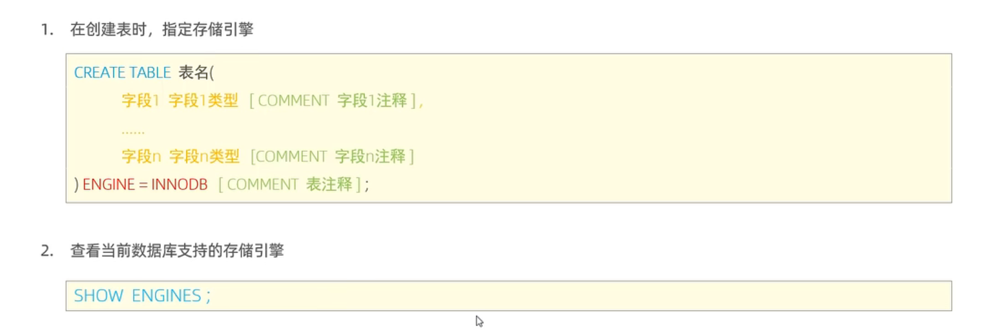
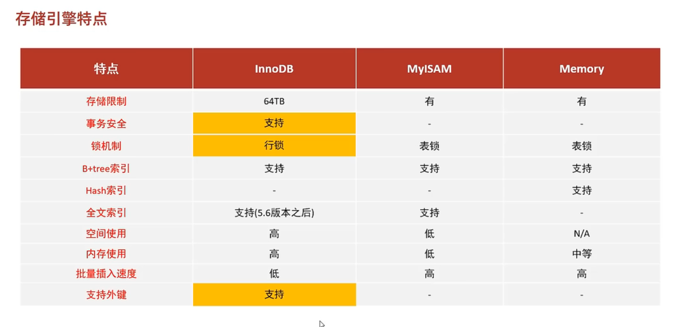
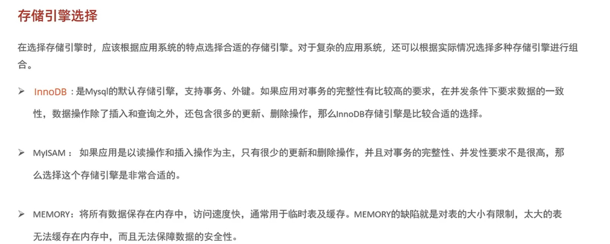

### 一、定义

​	存储引擎就是数据库存储数据、建立索引、更新/查询数据等技术的实现方式。存储引擎是基于表的，而不是基于库的，也就是说在创建表时可以为其指定存储引擎(默认是Innodb)，因此存储引擎也被称为表类型。

### 二、创建表时指定存储引擎

​	

​	关键字ENGINE指定存储引擎。

### 三、索引引擎之间的区别

### 四、存储引擎的选择

​	适用MEMORY引擎的场景现在已经大多数被Redis数据库替代。

