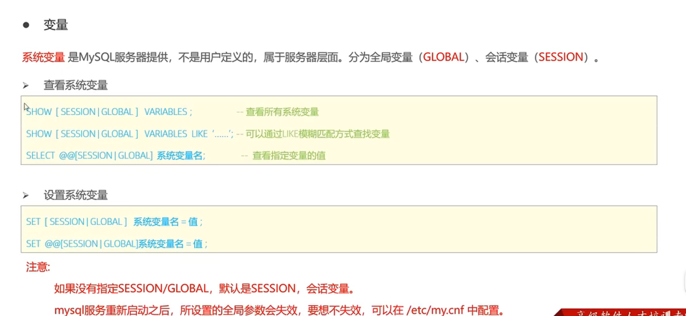
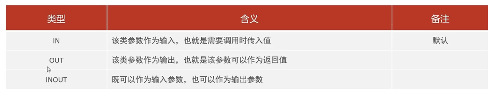
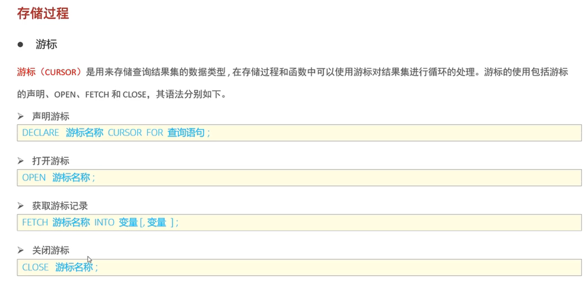
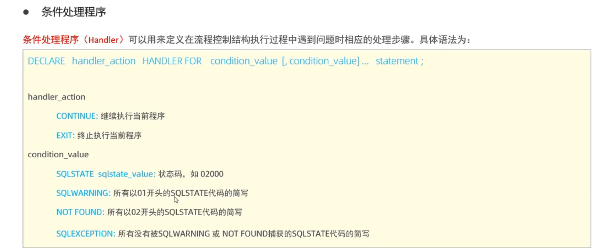
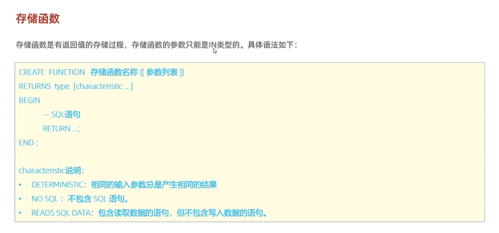

## 一、概念

​	存储过程是事先经过编译并存储在数据库中的一段SQL语句集合，调用存储过程可以减少数据在数据库和应用服务器之间的传输。存储过程在思想上就是数据库SQL层面的代码封装和调用。存储过程可以接收参数，也可以返回数据。

## 二、基本语法

### 2.1 创建和调用

```mysql
CREATE PROCEDURE  <procedure_name> ([arg_list])
BEGIN
	#SQL语句
END;

#调用：
CALL <prodedure_name>(args);

# 在命令行中创建存储过程时，由于创建语句中存在多个;  需要通过delimiter修改mysql语句的结束符
#例如 delimiter $$
```

### 2.2 查看

```mysql
#查看指定的数据库的存储过程及其信息：
SELECT * FROM INFORMATION_SCHEMA.ROUTINES WHERE ROUTINE_SCHEMA='database_name';

#查询某个存储过程的定义：
SHOW CREATE PROCEDURE <procedure_name>;
```

### 2.3 删除

```mysql
DROP PROCEDURE [IF EXISTS] <procedure_name>
```

## 三、变量

### 3.1 系统变量

 

### 3.2 用户自定义变量

```mysql
#赋值：
SET @<name>=<value>; #一条set语句可以创建多个变量，方法是创建一个后加上逗号，然后同样的@<name>=<value>
SET @<name>:=<value>;# = 和 := 都可以赋值，推荐用后者，因为mysql中比较符也是=
SELECT @<name>:=<value>; #SELECT同样可以用来赋值变量，同样可以同时赋值多个
SELECT <字段名> into @<变量名> FROM <表名>;#用查询的方式给变量赋值

#如果变量没有初始化，其值为null

#使用：
SELECT @<name>;
```

### 3.3 局部变量

​	局部变量是指在局部生效的变量，与用户自定义变量不同，局部变量需要用关键字DECLARE声明，可用作存储过程的局部变量和输入参数，其范围是声明时所属的BEGIN END块。

```mysql
#声明
DECLARE <name><type> [DEFAULT ...] #default代表可以给变量指定初始值，局部变量需要指定类型
#赋值
SET <name> = <value>;
SET <name> :=<value>;
SELECT 字段名 INTO 变量名 FROM 表名；

```

### 3.4 存储过程的参数



​	注意：在给存储过程定义参数时，需要同时给出类型。传递的参数需要在存储过程之外进行定义，也就是说，传出参数和传入传出参数并不是在存储过程内定义然后返回，而是事先定义好，再由存储过程进行修改。

## 四、逻辑块

### 4.1 IF语句

```mysql
IF 条件1 THEN
	#一些SQL语句
ELSE IF 条件2 THEN  #可选
	#一些SQL语句
ELSE               #可选
	#一些SQL语句
END IF;
```

### 4.2 CASE语句

```mysql
### 方式一：
CASE case_value
	WHEN value1 THEN
		#一些SQL语句;
	WHEN value2 THEN
		#一些SQL语句;
	ELSE
		#一些SQL语句;   else类似default
END CASE ;


### 方式二 相较于方式一，不采用值比较的方式，而采用条件表达式是否成立
CASE
	WHEN condition1 THEN
		#一些SQL语句;
	WHEN condition2 THEN
		#一些SQL语句;
	ELSE
		#一些SQL语句;
END CASE;
```

### 4.3WHILE语句

```mysql
WHILE <条件> DO
	#一些SQL语句;
END WHILE
例：
CREATE PROCEDURE p1(IN n int)
BEGIN
	declare total int default 0;
	WHILE n>0 DO
		set total := total+n;
		set n := n-1; 
	END WHILE;
END;
```

### 4.4 REPEAT语句

​	repeat与while不同，repeat是直到某个条件满足就退出循环

```mysql
REPEAT
	#一些SQL语句;
	UNTIL 条件
END REPEAT;
例：
CREATE PROCEDURE p1(IN n int)
BEGIN
	declare total int default 0;
	REPEAT
		set total := total+n;
		set n := n-1;
	UNTIL n<=0
	END REPEAT;
END
```

### 4.5 loop语句

​	loop实现简单的循环，如果不在循环体中添加退出语句，将一致循环下去。loop需要有一个名称，或者说一个label，来让控制循环的语句有目标。

```mysql
<label> LOOP
	#SQL逻辑;
END LOOP <label>
#控制循环的语句：
LEAVE label;#退出循环
ITERATE label;#进入下一次循环，类似continue
例：
CREATE PROCEDURE p1(in n int)
BEGIN
	declare total int default 0;
	SUM LOOP
		if n<=0 then
			leave SUM;
		end if;
		if n%2!=0 then
			set n:=n+1;
			ITERATE SUM;#continue
		end if;
		
		set total:=total+n;
		set n:=n-1;
	END LOOP SUM:
END;
```

## 五、游标

### 5.1 基本使用方法



​	可用于在存储过程中创建表(将查询结构存在游标里，然后一条条取出放在各个变量中，再用insert语句将这一个个变量的值插入到对应的字段)。

### 5.2 MySQL中的条件处理程序

​	
​	即满足某个条件就执行对应的动作的语句，动作包括EXIT和CONTINUE，而且可以附加一些statment。当在存储过程中使用游标来创建表时，对于取游标中数据这个动作只能用while来进行，而循环条件不好写，只能while true，但是取到游标为空的时候又会报错，因此需要条件处理程序。例：

```mysql
DECLARE EXIT HANDLER FOR SQLSTATE '02000' CLOSE u_corsur;
#定义一个条件处理程序，当SQL状态码为02000时触发，动作是中止当前程序并关闭游标
#02000对应的是读取空游标时MYSQL的状态码
```

## 六、存储函数



​	存储函数能做的事，存储过程也都能做。

