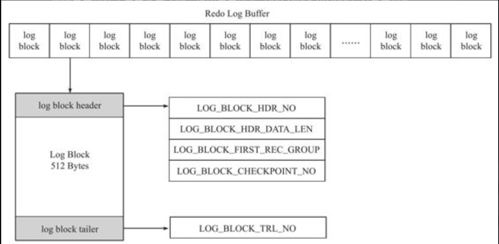

### 一、redo log

#### 1.1 基本概念

​	redo log是MySQL数据库保证事物持久性的机制，它是一种物理日志，记录数据的变化，在数据库发生宕机时，后续重启就依靠redo log来回复buffer pool中未被及时刷新到磁盘的脏页数据。在事物提交时，必须先将该事物的所有日志写入重做日志文件进行持久化。它由两个部分组成，一个是位于内存中的redo log buffer，一个是位于磁盘上的redo log file。

​	参数innodb_flush_log_at_tex_commit控制redo log刷新到磁盘的策略，比较需要关注的是调用fsync的时间点，它对性能的影响比较大。

​	  

#### 1.2 log block和log file

​	MySQL的重做日志是以大小为512字节的block进行存储的，当一个事物产生的重做日志大小超过512字节时，会被存储在多个块当中。log block除了日志主体外，还包括block header和block tailer

*   LOG_BLOCK_HDR_NP：log buffer是由一个个log block组成的数组，因此这个字段的含义是该liog block是log bufeer中的第几个log block，类似数组下标。
*   LOG_BLOCK_HDR_DATA_LEN：表示log block所使用的空间大小，当log被写满时，该值为0X200，也就是512字节

​	log block中头部和尾部加起来占了20字节，也就是说每个log block实际上只能存储492字节的redo log。

​	InnoDB存储引擎默认使用两个log file来存储重做日志，内存中log buffer中的log block按照一定的规则写入log file中，当一个写满时就写入另外一个。log block的写入规则如下：

*   事物提交时
*   当log buffer中有超过一半的空间被使用时
*   log checkpoint时

#### 1.3 重做日志的格式

​	对数据库中数据的不同操作将对应不同类型的重做日志格式，虽然格式不同，但它们的头部是相同的：

*   redo_log_type：重做日志类型
*   space：表空间ID
*   page_no：页的偏移量
*   redo log body：日志主体

#### 1.4 LSN

​	LSN的全称是Log Sequence Number，代表日志序列号，它是一个八位整数，单调递增。LSN表示的含义有：1. 重做日志写入的总量   2.  数据页的版本   3. checkpoint的位置。如果每一次数据库宕机，都把重做日志全部用于恢复数据，将会导致很多无效操作，因为磁盘中重做日志文件里记录的一些对数据的操作是已经刷新到磁盘上的，而通过对比LSN，可以只应用那部分还没来得及刷新到磁盘的数据操作日志。

### 二、undo log

#### 2.1 基本概念

​	undo log用于数据回滚以及MVCC。在对数据做修改时，除了会产生redo log，同时也会产生一定量的undo log，在存储方面，undo log存放在共享表空间中，总共128个回滚段，每个回滚段有1024个undo segment，而在每个undo segment中进行undo页的申请，也就是说最多支持128*1024个同时在线事物。

​	undo log通过记录与DML操作相反的操作来打到可提供回滚，例如对于insert操作，undo log记录对应主键的delete操作，对于delete操作，则是记录下那一行数据的insert操作，而对于updata则是记录被修改了的旧列值。

​	undo log不仅用于回滚对数据的修改，还可以保证事物ACID特性中的原子性，通过每一行数据中的隐藏列：roll_pointer，可以顺着roll_pointer找到之前版本的数据，以屏蔽其它未提交事物对数据的修改： 

#### 2.2 undo log相关参数

​	innodb undo directory：用于设置roll back segment所在文件的路径
​	innodb undo logs：用来设置roll back segment的个数，默认为128个
​	innodb undo tablespace：用来设置构成roll back segment文件的个数，可以使undo log分布在不同文件中