## 一、概述

​	索引是一种数据结构，需要数据库的引擎来进行维护，索引可以用于高效地获取数据，这些数据结构以某种方式(引用)指向数据库中的数据，这样就可以在这些数据结构上实现高级查找算法。需要注意的是：B+树索引并不能找到一个给定键值的具体行，它只能找到被查找数据行所在的页，然后数据库把页读取到内存，然后再从页中查找得到想要的数据。

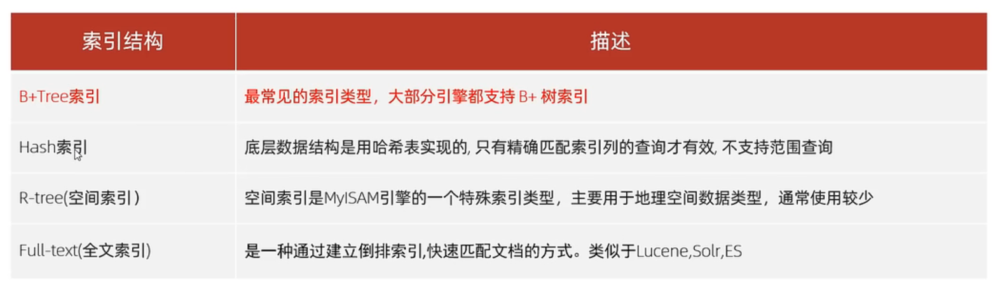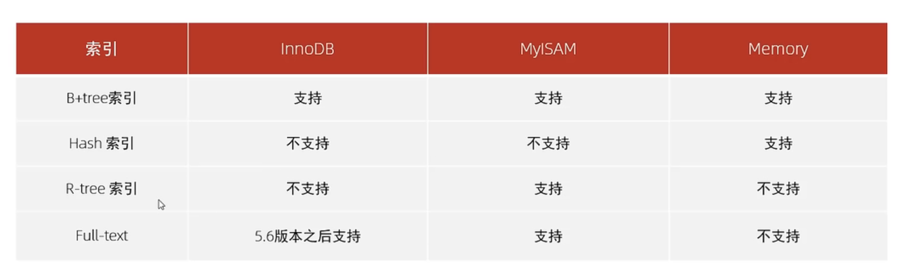

## 二、索引类型

​	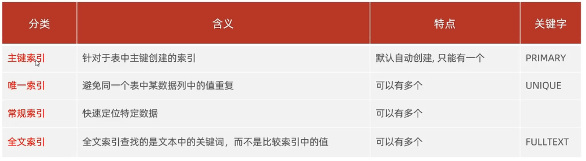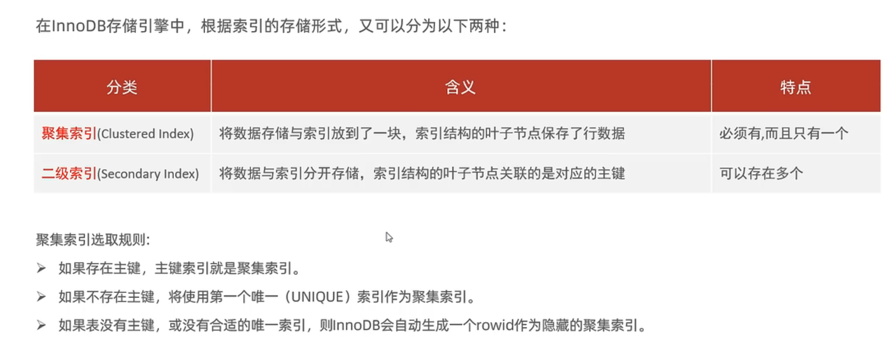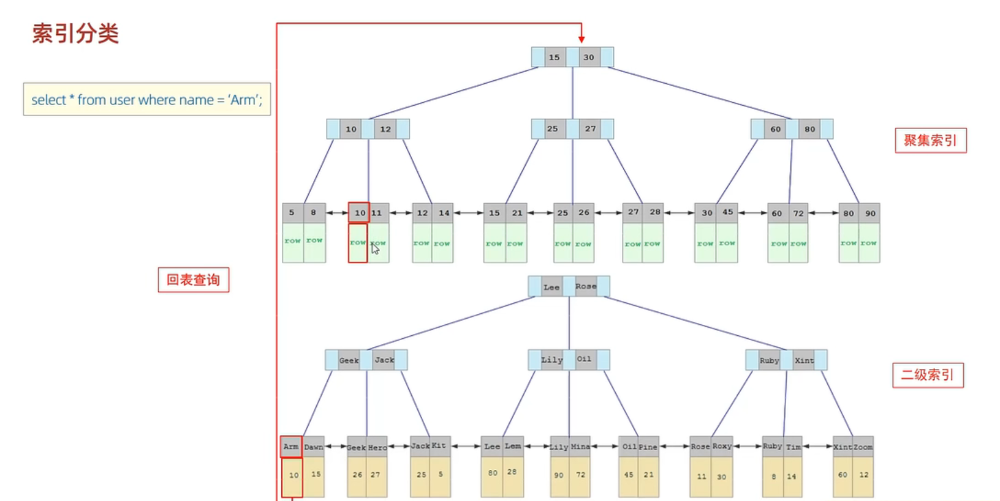

## 三、索引相关语法

1.  创建索引： CREATE INDEX [UNIQUE | FULLTEXT]  index_name ON table （字段1、字段2......）
2.  查看索引：SHOW INDEX FROM table
3.  删除索引：DROP INDEX  index_name FROM  table

## 四、性能分析

### 4.1 查看执行频率

​	通过命令：  SHOW  [GLOABLE | SESSION]  STATUS LIKE 'Com ___'   查看当数据库的增删查改命令的执行次数，参数SESSION表示当前会话，GLOBAL表示所有数据。增删查改对应的是SELECT   INSERT   DELETE  UPDATE这些命令，注意，模糊匹配中后面加了7个 _。

### 4.2 慢查询日志

​	在mysql的配置文件中，加入 slow_query_log = 1  ,   long_query_time=2  , 前者表示开启慢查询日志，后者表示当一条查询语句超过2秒，就记录到日志中，日志的位置在/var/lib/mysql下，不同系统的日志文件名不同。

### 4.3 profile系列命令

1.  查看是否支持profile :  show  @@have_profiling
2.  开启profile :  set profile=1;
3.  查看每一条sql的耗时情况：show profiles;
4.  查看指定的sql语句的各个阶段耗时情况：show profile for query  <queryid>,  这个queryid可以从第三条语句的查询结果中得到

### 4.4 explain

​	在select语句前加上explain或desc，可以得到这条select语句的详细信息。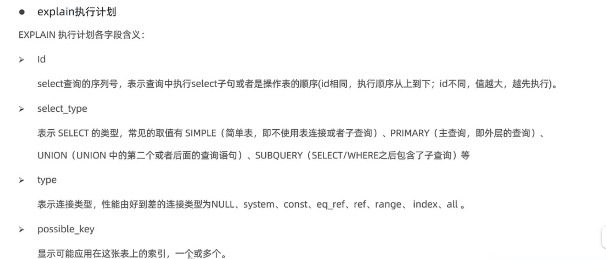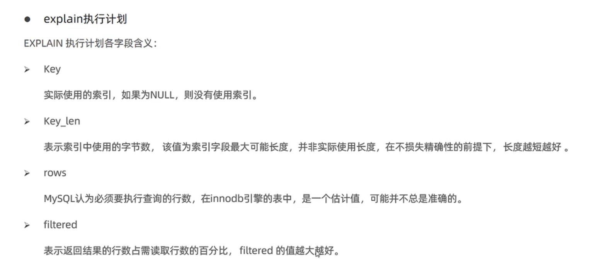

### 4.5 Cardinality值

​	并不是所有在查询条件中出现的列都需要添加索引，一般的经验是，在访问表中很少一部分时使用B+树索引采有意义，例如性别字段，只有男性或女性，查询时要么条件是男性，要么条件是女性，这样约等于把数据库中一半的数据都取出来，对这样的列添加索引是很没必要的，性别、地区、类型等这些字段的可取值范围很小，称为地选择性，添加索引时应该添加到高选择性字段，而衡量选择性的值就是Cardinality。

​	可以通过SHOW INDEX值来查看索引列的Cardinality值，它的含义是**索引列中不重复记录的预估值**，通俗来讲就是预估一个列中的所有数据大概有多少个是互不相同的，Cardinality/n_rows_in_table应尽可能接近1，如果非常小，那么需要考虑是不是有必要创建这个索引。

### 4.6 覆盖索引

​	覆盖索引的意思是，查询时如果需要的数据都包含在索引列当中，那么走完二级索引就可以获取到全部数据而不需要多一次回表查询。同时，对于统计问题，InnoDB存储引擎并不会选择通过查询聚集索引来进行统计(如果有二级索引存在)，因为二级索引的叶子节点不保存全部数据，因此比聚集索引要小，这也意味着需要的IO次数少。

### 4.7 Multi-Range Read优化

​	MRR优化的目的是为了减少磁盘随机访问，将随机访问转化为较为顺序的数据访问。在查询二级索引时，首先根据得到的查询结果，按照主键进行排序，然后按照主键排序的顺序进行回表查询，这样可以顺序的访问磁盘数据，并且尽可能减少缓冲池中页被替换的次数。
​	此外,MRR还可以将某些范围查询拆分成键值对，这样做的好处是在拆分过程中直接过滤掉一些不符合查询条件的数据，例如下列SQL语句：

```mysql
SELECT * FROM t
WHERE key1>=1000 AND key1<2000
AND key2=10000
```

​	若没有使用MRR，则SQL优化器会先将符合key1条件的数据全部取出，然后再根据key2的条件进行过滤，这将导致无用数据被取出，若使用了MRR优化，则优化器会先将拆查询条件优化为(1000,10000),(1001,10000)....然后再根据这些拆分出的条件进行数据的查询。
​	参数optimizer_switch中的flag mrr和mrr_cost_base决定是否启用MRR优化。mrr为on时表示启用mrr优化，mrr_cost_based表示是否通过cost based的方式来决定是否启用mrr，将mrr设置为on，mrr_cost_based设置为off则总是启用MRR优化。参数read_rnd_buffer_size控制键值的缓冲区大小，大于该值时执行器对已经缓存的数据根据ROW_ID排序然后根据ROWID取得行数据，该值默认为256K。

### 4.8 Index Condition Pushdown(ICP)优化

​	简单来说，开启ICP优化后，MySQL数据库会在取出索引的同时判断是否可以进行WHERE条件的过滤，也就是将WHERE的部分过滤操作放在存储引擎层，从而大大减少上层SQL层多记录的索取(fetch)，从而提高数据库整体性能。当然，可以过滤的条件是要该索引可以覆盖到的范围。例如查询条件跟a、b、c列有关，然后走的索引只跟a、b列有关，那么就无法对c这个列做提前判断。

## 五、使用规则

### 5.1 最左前缀法则

​	如果索引使用了多个列，要遵守最左前缀法则，最左前缀法则指的是从索引所包含的所有列中，从最左列开始，并且不跳过任一列，如果跳过了，那么从那一列开始后面的索引全部失效。

### 5.2 范围查询

​	联合索引中，如果出现( <   ,   >)这样的范围索引时，做了范围查询的字段的右侧字段会全部失效(也就是不走索引)，解决方法是，在逻辑成立的前提下尽量使用>=  <=

### 5.3 索引列运算

​	对字段进行运算时(例如函数)，会使得字段对应索引失效

### 5.4 字符串

​	如果查询时对字符串变量不加单引号，会导致索引失效

### 5.5 模糊匹配

​	如果是尾部模糊匹配，则索引仍旧生效，如果是头部模糊匹配，索引失效

### 5.6 or连接

​	对于用or连接的各个字段，如果or前面的条件有索引、后面的没有，那么这条查询语句不会走索引

### 5.7 数据分布影响

​	如果mysql评估使用索引比全表扫描还慢，就不走索引(例如查询的条件表中绝大部分数据满足，一般在20%左右)。理由是顺序读要远远快于离散读，而走二级索引再去回表查询的操作在这种需要取出大量数据的情况下是非常耗时的。

### 5.8 SQL提示

​	SQL是一种优化的重要手段，用于在SQL语句中加入人为提示来达到优化操作的目的，例如指定使用某个索引。

1.  use index  例： SELECT * FROM tb_user USE INDEX(<index name>)  WHERE 。。。。。。
2.  ignore index  例： SELECT * FROM tb_user IGNORE INDEX(<index name>)  WHERE 。。。。。。 
3.  force index 例:  SELECT * FROM tb_user FORCE INDEX(<index name>)  WHERE 。。。。。。 

注：use只是起到建议作用，具体用不用还得看mysql的评估，而force是更强硬的命令，让mysql必须使用指定的索引

### 5.9 覆盖索引

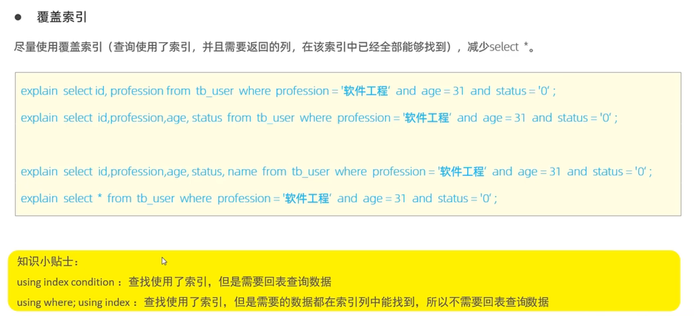

### 5.10 前缀索引

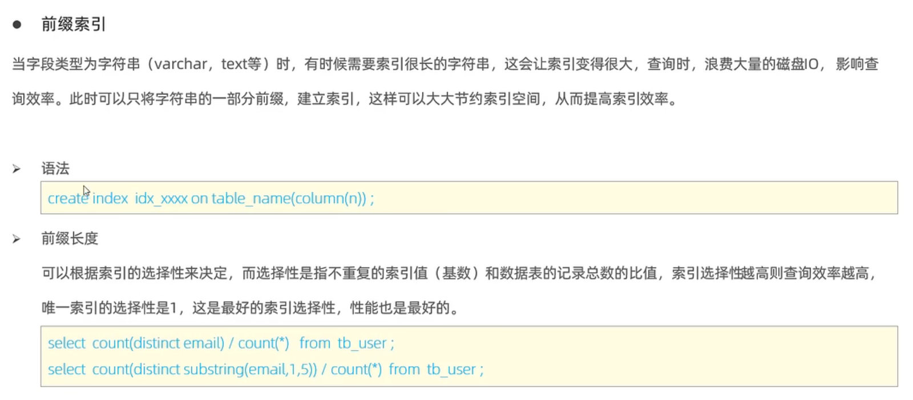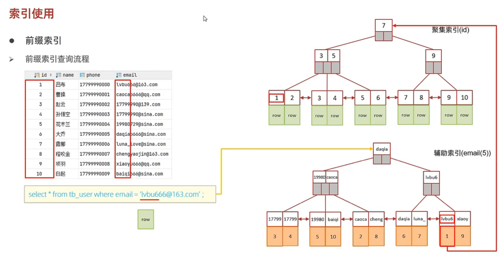

只选择字符串的一部分前缀来建立索引。

### 5.11 单列索引和联合索引

1.  选择上：如果查询时包含对多个字段的查询，最好使用联合索引
2.  联合索引的形式：B+树的节点中将会有多个字段的key值，按照创建索引时的顺序，先比较最左边的字段，如果相等则比较倒数第二右边的字段，依次类推。

## 六、 索引设计规则

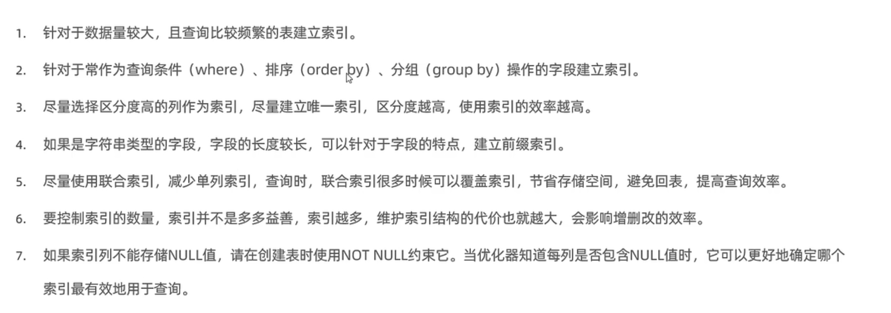

