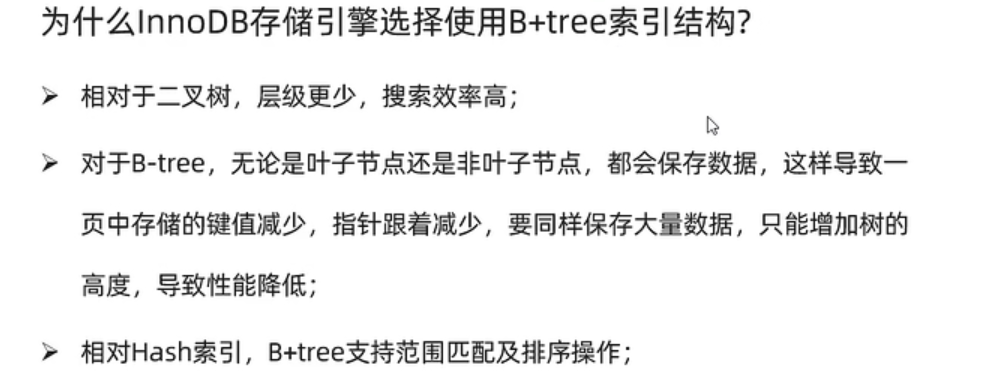

## 一、概述

​	索引是一种数据结构，需要数据库的引擎来进行维护，索引可以用于高效地获取数据，这些数据结构以某种方式(引用)指向数据库中的数据，这样就可以在这些数据结构上实现高级查找算法。

## 二、索引类型

​	

## 三、索引相关语法

1.  创建索引： CREATE INDEX [UNIQUE | FULLTEXT]  index_name ON table （字段1、字段2......）
2.  查看索引：SHOW INDEX FROM table
3.  删除索引：DROP INDEX  index_name FROM  table

## 四、性能分析

### 4.1 查看执行频率

​	通过命令：  SHOW  [GLOABLE | SESSION]  STATUS LIKE 'Com ___'   查看当数据库的增删查改命令的执行次数，参数SESSION表示当前会话，GLOBAL表示所有数据。增删查改对应的是SELECT   INSERT   DELETE  UPDATE这些命令，注意，模糊匹配中后面加了7个 _。

### 4.2 慢查询日志

​	在mysql的配置文件中，加入 slow_query_log = 1  ,   long_query_time=2  , 前者表示开启慢查询日志，后者表示当一条查询语句超过2秒，就记录到日志中，日志的位置在/var/lib/mysql下，不同系统的日志文件名不同。

### 4.3 profile系列命令

1.  查看是否支持profile :  show  @@have_profiling
2.  开启profile :  set profile=1;
3.  查看每一条sql的耗时情况：show profiles;
4.  查看指定的sql语句的各个阶段耗时情况：show profile for query  <queryid>,  这个queryid可以从第三条语句的查询结果中得到

### 4.4 explain

​	在select语句前加上explain或desc，可以得到这条select语句的详细信息。

​	

## 五、使用规则

### 5.1 最左前缀法则

​	如果索引使用了多个列，要遵守最左前缀法则，最左前缀法则指的是从索引所包含的所有列中，从最左列开始，并且不跳过任一列，如果跳过了，那么从那一列开始后面的索引全部失效。

### 5.2 范围查询

​	联合索引中，如果出现( <   ,   >)这样的范围索引时，做了范围查询的字段的右侧字段会全部失效(也就是不走索引)，解决方法是，在逻辑成立的前提下尽量使用>=  <=

### 5.3 索引列运算

​	对字段进行运算时(例如函数)，会使得字段对应索引失效

### 5.4 字符串

​	如果查询时对字符串变量不加单引号，会导致索引失效

### 5.5 模糊匹配

​	如果是尾部模糊匹配，则索引仍旧生效，如果是头部模糊匹配，索引失效

### 5.6 or连接

​	对于用or连接的各个字段，如果or前面的条件有索引、后面的没有，那么这条查询语句不会走索引

### 5.7 数据分布影响

​	如果mysql评估使用索引比全表扫描还慢，就不走索引(例如查询的条件表中绝大部分数据满足)

### 5.8 SQL提示

​	SQL是一种优化的重要手段，用于在SQL语句中加入人为提示来达到优化操作的目的，例如指定使用某个索引。

1.  use index  例： SELECT * FROM tb_user USE INDEX(<index name>)  WHERE 。。。。。。
2.  ignore index  例： SELECT * FROM tb_user IGNORE INDEX(<index name>)  WHERE 。。。。。。 
3.  force index 例:  SELECT * FROM tb_user FORCE INDEX(<index name>)  WHERE 。。。。。。 

注：use只是起到建议作用，具体用不用还得看mysql的评估，而force是更强硬的命令，让mysql必须使用指定的索引

### 5.9 覆盖索引

### 5.10 前缀索引

只选择字符串的一部分前缀来建立索引。

### 5.11 单列索引和联合索引

1.  选择上：如果查询时包含对多个字段的查询，最好使用联合索引
2.  联合索引的形式：B+树的节点中将会有多个字段的key值，按照创建索引时的顺序，先比较最左边的字段，如果相等则比较倒数第二右边的字段，依次类推。

## 六、 索引设计规则

