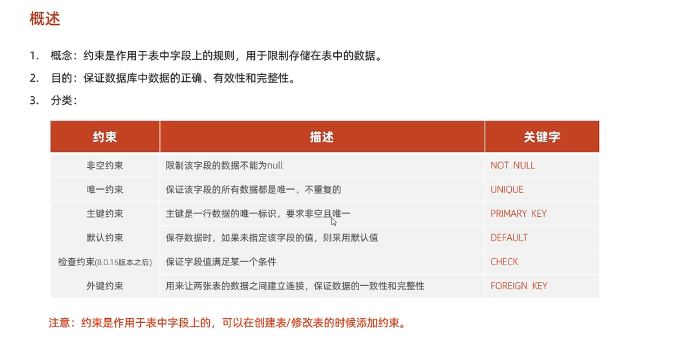
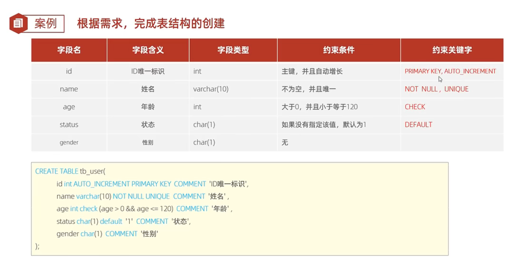
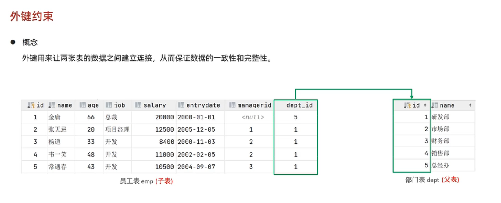
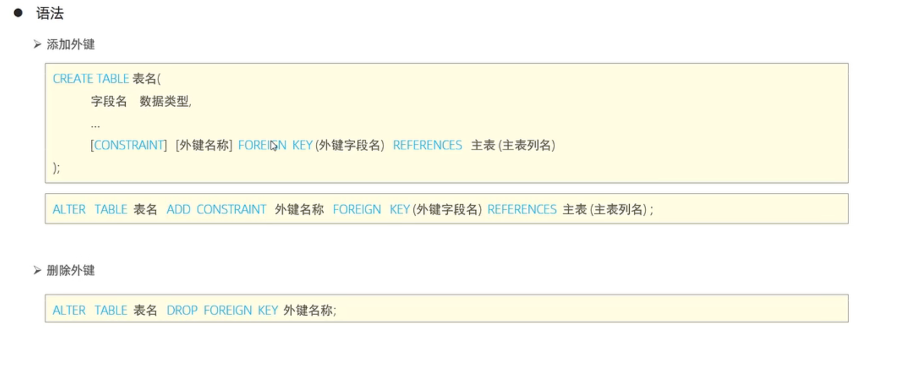
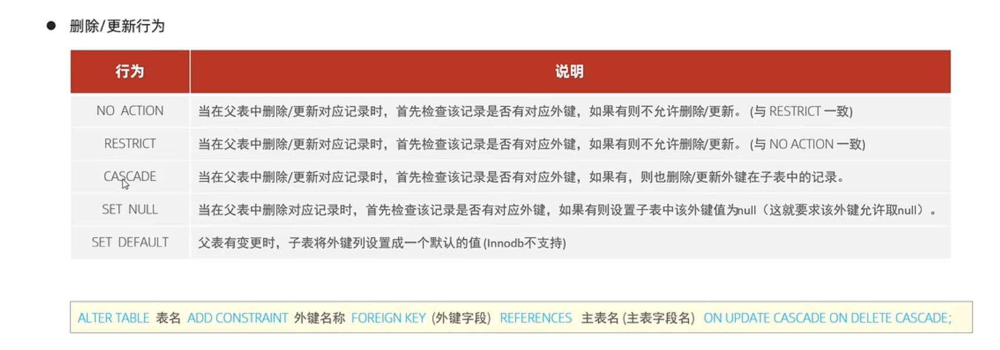

### 一、约束的概念和作用

### 二、使用示例

​	在创建表的时候直接在字段名后面添加约束，不同约束之间用空格隔开

### 三、外键约束

​	外键约束是在两个及以上的表中字段进行连接，连接建立后父表不可随意删除数据(会报错)

可以通过SQL语句设定父表与子表之间的外键关联行为：

其中，on update是指父表中数据发生改变时，on delete是指父表中与子表关联的数据被删除时，在这些行为中，第一个NO ACTION和第二个RESTRICT是行为一致的，这两个也是默认行为。