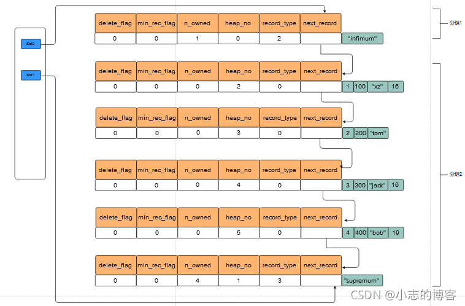

### 一、索引组织表

​	InnoDB引擎中，数据是按照主键顺序存放的，这种存储方式的表称为索引组织表。如果创建表时没有显式定义主键，就以表中的非空唯一索引作为主键，要是还没有，InnoDB引擎会自动创建一个隐藏的主键列。定义表时可以将多个列定义为主键，这种称为联合主键，每一行的多个列的组合各不相同。

### 二、InnoDB逻辑存储结构

​	InnoDB存储引擎中，所有数据都被逻辑地放在一个空间中，这个空间就叫表空间，表空间由段、区、页组成。

#### 2.1 表空间

​	每张表的表空间内存放的只有数据、索引和插入缓冲Bitmap页，其它类型的数据，例如undo、插入缓冲索引页等存放在共享信息表空间内。

#### 2.2 段

​	表空间是由各个段组成的，常见的有数据段、索引段、回滚段等。数据就是索引，索引就是数据。因此数据段就是B+树的叶子节点，索引段就是B+树的非叶子节点。

#### 2.3 区

​	区是由页组成的连续空间，在任何情况下区的大小都为1MB，也就是64个连续页。InnoDB存储引擎一次性从磁盘申请4~5个区，保证页的连续性。

#### 2.4 页

​	页是InnoDB磁盘管理的最小单位，默认16KB，在1.2.x版本开始，可以通过参数innodb_page_size将页的大小设置为4K\8K\16K。

#### 2.5 行

​	InnoDB存储引擎是面向列的，也就是说数据是一行一行存放，每个页最多允许存放7992行记录。

### 三、InnoDB行记录格式

​	数据库实例的作用之一就是读取页中存放的行记录。

#### 3.1 Compact行记录格式

Compact格式下一行数据在页在的组成为：

*   变长字段长度列表：记录数据中各个边长字段列的长度，按照列的顺序逆序存放
*   NULL标志位：指示了该行数据中是否有NULL值，有则用1表示，占1字节
*   记录头信息：固定占用5字节，也就是40位，其作用是记录该行数据的一些关键信息，例如是否已被删除、记录类型、页中下一条记录的相对位置等
*   数据
*   两个隐藏列：事物ID列和回滚指针列，分别为6字节和7字节大小。

#### 3.2 行溢出数据

​	InnoDB存储引擎可以将一条记录中的某些数据存储在真正的数据页面外，例如BLOL，LOB这类大对象或者是过长的VARCHAR数据。页中存放数据实际上是以链表的形式，因此引擎会保证一个页中至少有两行数据。至于溢出的部分，将存放在类型为Uncompress BLOB页中而不是原来的数据页中，原来的数据页将保存一部分该数据的前缀以及一个指向行溢出页的指针。

#### 3.3 CHAR的行存储结构

​	char相较于varchar，它是固定长度的字符串，如果插入的数据的长度小于创建表时指定的char这一列的长度，那么引擎会插入0X20字符填满剩余的空位，变长字段长度列表页不会记录char这一列的长度，但这都是在字符集为单字符的情况下。MySQL从4.1开始，CHAR(n)中的n指的就是字符的长度而不是字节的长度，因此如果使用多字节的字符集，例如GBK，那么相同字符长度的数据将占用不同的字节，例如’ab‘和“我们”，前者占用2字节，后者占用4字节，但它们都是双字符。因此在这种条件下，CHAR类型不再代表固定长度的字符串，变长长度列表中将记录CHAR类型的长度。可以认为，在使用多字符集的情况下，char和VARCHAR区别不大。

### 四、InnoDB数据页结构

​	

#### 4.1 File Header

​	用来记录页的一些头信息，例如当前页的checksum值，表空间中当前页的偏移值(例如某独立表空间a.idb的大小为1GB，页的大小为16KB，那么这个独立表空间中就有65536个页，偏移值就表示当前页是这个表空间中的第几个页)，LSN、指向上一个页和下一个页的指针以及页的类型。

#### 4.2 Page Header

​	记录数据页的状态信息，例如页中记录的数量、索引ID(表示当前页属于哪个索引)等

#### 4.3 Infimum 和 Suprenum 记录

​	每个数据页都要两个虚拟的行记录，用来限定记录的边界

#### 4.4 User Record 和 Free Space

​	User Record就是实际存储行记录的内存，而Free Space指的是页中的空闲空间，同样也是个链表数据结构，在一条记录被删除后，该空间会被加入空闲链表中。

#### 4.5 Page Directoy

​	Page Diretoy的作用是快速在页中查找某个主键对应的记录。页中记录以链表方式存储，如果没有页目录，就只能遍历整个页，有了页目录则可以实现二分查找。

​	具体实现是，Page Diretoy将多条记录分组，每一个组可以视为一个槽，槽的逻辑意义是**指向组内主键值最大的记录**， 对于Infimum记录所在的分组只能有1条记录、 对于Supremum记录所在的分组只能在1～8条记录之间， 剩下的记录所在的分组只能在4～8条记录之间。一开始时只有Infimum和Supremum两个组，之后每插入一条新记录，都会在页目录中查找**比待插入记录主键值大且差值最小的槽**，然后把这个槽的n_owned值+1，这个值代表当前组内记录数量。当一个槽的记录数量大于8时，会进行拆分。  

​	可以看到，页目录中的槽就是指向组内主键值最大的记录。查找记录时，就根据主键值二分地找到对应的槽，然后遍历槽中的几个记录。

#### 4.6 File Trailer

​	File Trailer部分是为了检测页是否已经完整地写入磁盘。由8字节组成，前4字节代表该页的checksum值，后4字节代表LSN值，将这两个值与File Header中的checksum和LSN比较就可以知道页的完整性有没有被破坏

### 五、分区表

​	分区表就是将一个表中的数据分散的保存在几个表空间中，逻辑上只有一个表或一个索引，但在物理上这个表或索引可能由数十个物理分区组成。Mysql的分区是局部分区索引，即一个分区中既存放了数据又存放了索引。

#### 5.1 Range分区

​	简单来说就是根据指定列的值来划分区间，插入数据属于哪个区间就存储到哪个区间对应的物理分区中。

```mysql
CREATE TABLE t{
	id INT
}ENGINE=INNODB
PARTITION BY RANGE(id)(
	PARTITION P0 VALUES LESS THAN(10),
    PARTITION P1 VALUES LESS THAN(20)
);
```

​	以上语句创建了一个id列的区间分区表，当id小于10时放入p0，当id大于10小于20时放入p1。NULL值默认放在最左边的区间，也就是默认为最小值。如果此时插入一条记录，id是30，那么将会报错，原因在于30不属于任何一个区间，针对这个问题，可以加一个MAXVALUE值的分区，MAXVALUE可以理解为正无穷。

#### 5.2 LIST分区

​	List分区与Range分区类似，但是其值是离散的而不是连续的：

```mysql
CREATE TABLE t{
	id INT
}ENGINE=INNODB
PARTITION BY LIST(id)(
	PARTITION P0 VALUES IN (1,3,5,7,9,NULL),
    PARTITION P1 VALUES IN (0,2,4,6,8)
);
```

​		比较不同的一个是NULL值的处理，List分区必须有一个分区明确指出可以接收NULL值，否则对NULL值的插入将报错，另一个是多条记录插入时，某些记录的值不属于任何区间，这种情况下MyISAM引擎会将之前的记录都插入，但之后的记录都不会插入，InnoDB引擎则将其视为一个事物，因此将没有任何数据插入。

#### 5.3 Hash分区

​	Hash分区目的是尽量均匀的将数据分布到各个区间中，也就是说MySQL将自动决定数据的去向，用户所要作的就是提供将要进行哈希分区的列值指定一个表达式，以及分区数量。

```mysql
CREATE TABLE t_hash(
	a INT,
	b DATETIME
)ENGINE=INNODB
PARTITION=InnoDB
PARTITION BY HASH (YEAR(b))
PARTITIONS 4;
```

​	以上语句为这个表创建一个Hash分区，分区数量为4，且根据字段b进行哈希，提供的表达式是YEAR函数。

#### 5.4 KEY分区

​	KEY分区和HASH分区类似，不同之处在于Hash分区使用用户提供的函数，KEY分区使用Mysql数据库提供的函数进行分区。

#### 5.5 COLUMNS分区

​	前面提到的四种分区的条件都是分区列的数据必须是整形，MySQL5.5开始支持COLUMNS分区，这种分区可以直接使用非整型数据进行分区。

#### 5.6 子分区

​	子分区的意思是在分区的基础上再进行分区：

```mysql
CREATE TABLE ts(a INT,b DATE)engine=innodb
PARTITION BY RANGE(YEAR(b))
SUBPARTITION BY HASH(TO_DAYS(b))
SUBPARTITION 2(
	PARTITION p0 VALUES LESS THAN(1990),
    PARTITION P1 VALUES LESS THAN(2000),
    PARTITION P2 VALUES LESS THAN MAXVALUE
);
```

​	以上语句创建一个子分区的表，首先是根据range分区进行物理分区，然后又进行了一次HASH分区，总共的分区数量应该是2X3=6个。子分区的建立必须注意几个问题：

*   每个子分区数量相同
*   在一个分区表的任何分区上使用SUBPARTITION来明确定义任何子分区，就必须定义所有子分区

#### 5.7 分区和性能

​	分区并不一定会使得数据库的查询性能增加，具体问题要具体分析。数据库的应用分为两类，一类是OLTP(在线事件处理)，如电子商务，网络游戏等；另一类是OLAP(在线分析处理)，如数据仓库，数据集市。在实际环境中可能既有OLTP的应用又有OLAP的应用，例如网络游戏的数据库应用就是OLTP，但开发商可能要分析日志以优化游戏，此时就是OLAP的。
​	如果是OLAP，那么分区的却可以提高性能，因为OLAP通常需要扫描一张很大的表。而如果用了分区，可能就只需要查找具体的几个分区即可。
​	然而对应OLTP，分区应该非常小心，这种应用下通常读取的数据不会超过一张大表中的10%，大部分是通过索引返回几条记录即可，也就是说可能只需要2~3或者4~6次磁盘IO(聚集/非聚集索引)，但如果使用了分区技术，搞不好查询的性能会下降几十倍。如果是针对主键做了分区，那么针对主键的查询的确可以提高效率，因为往往只需要搜索一个分区，但如果查询的是普通列，那么需要搜索所有分区，此时性能相较原来就大幅度下降。