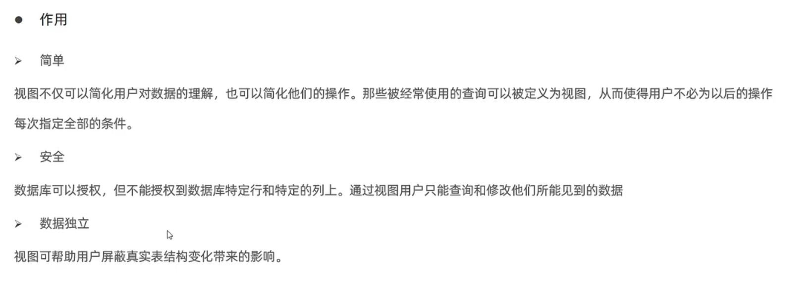
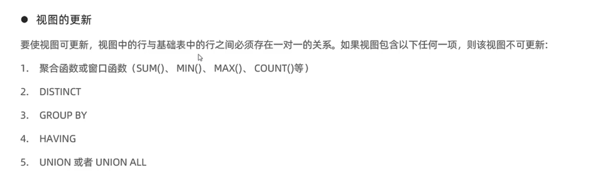

### 一、概念

​	 视图（view）是一种虚拟存在的表，是一个逻辑表，本身并不包含数据。作为一个select语句保存在数据字典中的。  通过视图，可以展现基表的部分数据；  视图数据来自定义视图的查询中使用的表，使用视图动态生成。  基表：用来创建视图的表叫做基表 

### 二、语法

1.  创建视图：CREATE [OR REPLACE] VIEW  <view name> AS SELECT ........ : 以一条select语句的结果创建视图
2.  查询创建视图的语句：SHOW CREATE VIEW <view name>
3.  查看视图数据：SELECT * FROM <view name>  （像查询普通表一样查询视图)
4.  修改视图：ALTER VIEW <view name> AS SELECT ......
5.  删除视图：DROP VIEW [IF EXISTS]  <view name> 

Tips: CREATE语句中，如果加上OR REPLACE也可起到修改视图的作用

### 三、检查选项

当在创建视图时增加了检查选项时，Mysql会检查对视图的更改是否符合视图的定义。Mysql还允许从一个视图创建另一个视图，因此它还会检查依赖视图中的规则以保持一致性，Mysql提供了CASCADED 和 LOCAL确定检查范围

1.  cascaded：检查创建当前视图的条件，以及当前视图所依赖的视图的创建条件，然后一层层向上检查。

2.  local：检查当前视图，然后一级级向上递归，如果上一级有定义check option就检查，没有就不检查。

3.  不加option：不检查当前层，但如果所依赖的上层有定义check option，还是会进行检查。

    Tips：local与cascaded的区别在于，加了cascaded后不管上层有没有check option都会做检查，而loacl的话，如果上层没有加check option就不检查

### 四、视图的作用和更新规则

