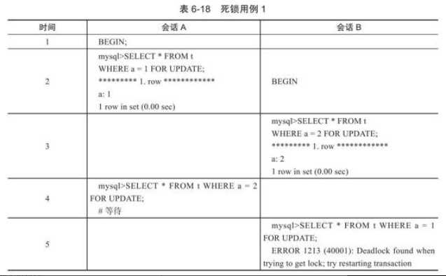

### 一、概念

​	锁是数据库用于在并发场景下保持数据一致性的工具。mysql的锁包括全局锁、表锁、行锁。

### 二、全局锁

​	全局锁顾名思义，会锁住整个数据库的所有数据，上了全局锁之后不能对其中的数据进行任何改动。适用于全库逻辑备份的场景。

#### 2.1 语法：

1.  创建全局锁： flush tables with read lock
2.  释放全局锁：unlock tables

#### 2.2优缺点

​	全局锁的优点在于其可以保证数据库备份时不被其它事务干扰，但缺点在于，开启全局锁后，整个数据库几乎处于停滞状态，其它客户端无法对数据库中的内容进行修改(会阻塞)。
​	InnoDB默认支持的事务隔离级别是可重复读，因此可利用这一点来避免全局锁。备份数据库的工具是mysqldump，在执行备份时加上参数 -single-transaction就会在备份前先开启事务，这样就不会阻塞其它试图修改数据库的客户端。这种数据库备份的模式本质上是快照备份。

### 三、表级锁

​	顾名思义，表级锁每次锁住一整个表。表级锁分为表锁、元数据锁和意向锁。

#### 3.1 表锁

表锁分为读锁和写锁，其语法为：lock tables  [table name]  read/write  ，释放锁的语法为：unlock tables。

1.  读锁：上了读锁之后，本线程和其它线程均不可对表中数据进行修改，但本线程和其它线程都可以读取表中数据。
2.  写锁：上了写锁之后，本线程可以对表进行读写，其它线程均不可对表进行读写。

#### 3.2 元数据锁

​	元数据锁简称MDL，MDL不用主动获取和释放，它产生于CRUD和对表结构的修改期间，作用是防止CRUD期间表结构产生改变。CRUD获取的是MDL读锁，而修改表结构获取的是MDL写锁。读锁之间可以共享，但写锁会独占。
​	假设有某个长事务在进行CRUD，开启事务时便获取了MDL读锁，且事务一直不提交，MDL读锁就一直没有释放。此时假设有另一个事务要对表结构进行更改，此时尝试获取MDL写锁，会被阻塞。如果这个MDL写锁一直被阻塞，其它线程的CRUD也会被阻塞，因为获取MDL锁是队列获取，且写锁的优先级高于读锁，因此这种情况会导致其它线程完全没有办法对这个表进行操作，哪怕只是读操作。解决方法可以是kill掉长事务。

#### 3.3 意向锁

​	当事务对表中的某一行数据进行修改时，会对这一行数据加上行独占锁，此时如果有其它线程企图对表加上表锁，就会发生冲突。如果没有意向锁，每次上表锁都要遍历整个表去查看是否有行锁，效率低下。有了意向锁就能快速判断。
​	InnoDB引擎在加上行锁前，会对表加上一个意向锁：行共享锁对应意向共享锁、行独占锁对应意向独占锁。也就是说，insert、update、delete都会加上意向独占锁，而select不会上锁。**意向共享锁跟独占锁都是表级别的锁，不会跟行级锁发生冲突，且意向锁之间也不会发生冲突，它只会和表锁发生冲突**。注意：意向共享锁与表的读锁不冲突。
​	select语句也可以对某些记录加上共享锁或独占锁：

```mysql
select ... lock in share mode #为读取的记录加上行级共享锁，并给表加上意向共享锁
share ... for update  #为读取的记录加上行级独占锁，并给表加上意向独占锁
```

### 四、行级锁

​	行级锁是InnoDB引擎中粒度最小的锁。它包括行锁、间隙锁、临键锁。其中行锁只针对某个具体的数据，间隙锁锁住的是一个范围，而临键锁是二者的结合，它即锁住范围，又将对应的记录上锁。

#### 4.1 唯一索引等值查询

​	假设有下列sql语句：

```mysql
begin;
select * from user where id=5;
```

这条sql语句使用的索引是唯一索引(主键索引)，情况将分为id=5的数据存在和不存在这两种：

1.  存在：InnoDB将临键锁优化为行锁，只锁住id=5这条数据
2.  不存在：InnoDB将临键锁优化为间隙锁，假设id=3和id=8存在，那么一开始的临键锁锁住的是(3,8]，优化为间隙锁后锁住的范围就变成(3，8)。

#### 4.2 唯一索引范围查询

​	假设有下列sql语句：

```mysql
begin;
select * from user where id>=5 AND id<6;
```

这条sql语句使用的索引是唯一索引，且不是等值查询而是范围查询。同样地情况将分为数据存在和不存在：

1.  存在：假设存在的数据是id=3，id=5和id=8，首先查找到的是id=5，此时临键锁优化为行锁，只锁住id=5这一行。然后找到id=8，但由于不满足id<6的条件，临键锁(5,8]会优化成间隙锁(5，8)
2.  不存在：假设存在的数据是id=3和id=8，且找不到数据，临键锁(3,8]会优化为间隙锁(3，8)

#### 4.3 非唯一索引等值查询

​	假设有下列sql语句：

```mysql
begin;
select id from user while age=20 for update;
```

注意，这条查询语句中使用的索引不是唯一索引，而是普通索引(针对age创建的索引)。因此情况会不一样，同样非为查得到与查不到两种情况：

1.  存在：假设存在数据age=10，age=20，age=30，首先会加临键锁，即(10,20]，由于是非唯一索引，这个临键锁不会优化为行锁。并且，由于是非唯一索引，还会额外加上一个行级锁，规则是向下扫描到第一个不符合条件的值才能停止，因此这个间隙锁为(20，30)。也就是说一共加了两把锁：(10，20]，(20，30)。
2.  不存在：假设存在数据age=10，age=30。引擎首先加的是临键锁(10,30]，由于查询结果不存在，将这个临键锁优化为间隙锁：(10,30)

#### 4.4 非唯一索引范围查询

​	假设有下列sql语句：

```mysql
begin;
select id from user while age>=20 AND age<25 for update;
```

同样地、非唯一索引，只是由等值查询变为范围查询。这种情况下，临键锁不会退化为间隙锁和行锁。

#### 4.5 对唯一索引列查询的补充

​	如果唯一索引列由多个列构成，而查询仅仅是查找多个唯一索引列中的一个，那么查询实际上是range类型查询，也就是说InnoDB引擎依然室友临键锁进行锁定。

### 五、锁的兼容性

​	

​	其中X表示排他锁，S表示共享锁，IS表示意向共享锁，IX表示意向排他锁。

### 六、死锁

​	死锁是指两个或两个以上的事物在执行过程中因争夺锁资源造成的一种互相等待的现象。其逻辑类似多线程开发下的死锁。死锁会导致并发性能下降，甚至任何一个事物都无法正常进行。解决死锁最简单的方法是超时，即两个事物互相等待时，当一个等待超过某个阈值时，对其中一个事物进行回滚，另一个等待的事物继续进行。参数innodb_lock_wait_timeout用来设置超时时间，默认是50秒

​	等待超时是一种比较浪费资源的解决方式。InnoDB存储引擎提供了更加主动的死锁检测手段：wait-for graph(等待图)。当事物T1等待事物T2释放锁时，图中T1就会有一条指向T2的边，当这个图出现回路代表死锁发生，此时InnoDB存储引擎会产生ERROR 1213并马上回滚一个事物，通常是会选择undo量最小的事物进行回滚，这样就意味着在应用程序中捕获了1213这号错误时不需要对其进行回滚。

#### 6.1 示例

表 t中的列a为主键，并且事先插入 1，2，4，5这四条记录

​	

​	首先会话A对记录4持有X锁，但由于列a是主键，因此这个当前读只会锁住记录4不会有间隙锁。然后会话B请求记录4的锁从而发生等待，再接着会话A试图插入记录3，然后InnoDB引擎报告死锁错误，这是因为虽然会话B没有得到记录4的S锁，但它做的是范围查询，对主键值1、2的记录都已经加锁成功(准确来说这里锁住的是一个范围)，因此会话A试图插入的操作将产生死锁。

### 七、丢失更新

​	丢失更新是一种逻辑上的错误，例如有两个事物，都读取某一行数据到应用程序，然后根据某种逻辑处理后，将新的值保存到数据库，此时两个事物的数值可能相互堆叠，即一个事物的值覆盖了另一个事物的值，这种处理方式在某些场景下是不允许的，例如转账：假设某个银行账户内有10000元，事物A转账9000元，事物B转账1元，两个操作都执行成功，然后A将余额设置为1000，但随后B将余额设置为9999，且同时另一方收到了这9000的转账，于是发生丢失更新。

​	解决的方法就是，将这种情况下的操作变为串行化：

​	可以看到，事物A读取余额时用了当前读，即给记录加上X锁，事务B需要等待A提交后才能读取余额，此时独到的余额就是1000，转账1元后设置新余额为999而不是9999。

### 八、锁升级

​	锁升级是指细粒度的锁升级为粗粒度的锁，例如行锁升级为页锁，这种情况一般是因为细粒度的锁开销太大，不得已牺牲一部分并发性能来进行锁升级，Microsoft SQL Server会发生锁升级行为，但MySQL不会，原因就在于InnoDB存储引擎使用锁的策略决定了锁并不是一种稀缺资源(不会过分占用内存)，它并不是根据每个记录来产生行锁，而是根据事务访问的页进行管理，采用的是位图方式。

​	假设有3000000个数据页，每个页大约100条记录，若对所有记录加锁，每个锁占用10字节，那么大约需要3GB内存，而使用位图的情况下，假设每个页存储的锁信息占用30字节，则需要90MB内存。