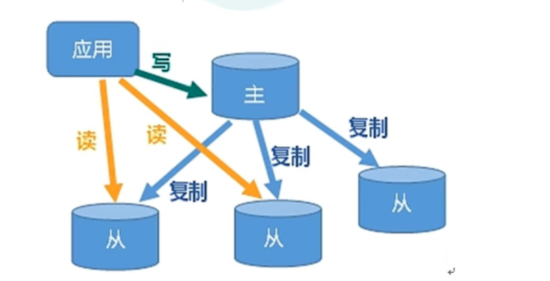
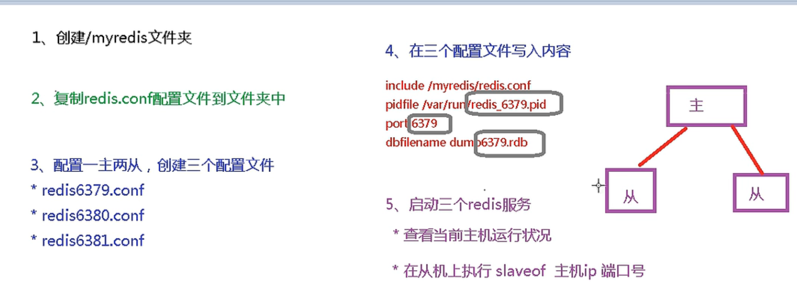

## 一、简介和作用

​	主从复制指的是，主机数据更新后，根据配置和策略同步到备机的Master/Slave机制，Master以写为主，Slave以读为主。作用主要是：1. 可以实现读写分离，提高性能。 2. 容灾发生时可以快速恢复，例如有一台从机宕机了，可以去读另外一台从机。



## 二、搭建一主多从的步骤



1.  先配置各自的redis.conf文件并复制到对应文件夹下
2.  根据ip、端口号和对应配置文件的位置启动服务
3.  一开始启动后均默认自己是主机，要设置为从机只需在命令行上写：slaveof  <host><port>，而如果输入的是 slaveof no one，则将从机变为主机，不再同步更新主机的数据，但原来的数据不会丢弃

设置完成之后，主机上发生的数据更改会同步更新到从机，而从机是不允许写操作的，例如set，只允许读。

### 2.1 复制过程

1.  从机第一次连上主机时：从机将发送sync命令给主机，主机收到命令后启动后台的存盘进程，同时收集所有修改数据的命令，后台进程执行完毕后，主机将传送整个数据文件到slave(rdb)，完成第一次完全同步。
2.  主机中有数据改动时：主机将新的所有收集到的修改命令依次传送给从机，完成数据同步

Tips: 当从机宕机而重启之后，依然默认自己是主机，此时需要重新用slaveof命令设置为从机，当然这里会允许上述第一点的过程，完成一次与主机的完全同步。而主机宕机，从机依然是从机，主机只需重新启动即可。命令**info replication**可以查看当前redis是主机还是从机、主/从机状态、host、端口等信息

### 2.2 薪火相传

​	在redis中，上一个slave可以是下一个slave的master，这样这个即是从机又是主机的redis，可以 可以接收其他从机的连接和同步请求从而减轻它的主机的工作压力，而这种方式的缺点就是，一旦某个从机宕机，后面的从机都无法备份。 

## 三、哨兵模式

​	哨兵模式可以用来监控主机，如果主机宕机，哨兵根据配置文件(不是redis.conf，是sentinel.conf)来选择下一个主机，被选中的从机自动转换为主机，而原来的主机哪怕重新启动，也只能作为新主机的从机。

### 3.1 哨兵配置文件

​	文件的路径为/<userpath>/sentinel.conf，内容如下：

```
# 禁止保护模式
protected-mode no
# 配置监听的主服务器，这里sentinel monitor代表监控，mymaster代表服务器的名称，可以自定义，192.168.11.128代表监控的主服务器，6379代表端口，2代表只有两个或两个以上的哨兵认为主服务器不可用的时候，才会进行failover操作。
sentinel monitor mymaster 192.168.11.128 6379 2
# sentinel author-pass定义服务的密码，mymaster是服务名称，123456是Redis服务器密码
# sentinel auth-pass <master-name> <password>
sentinel auth-pass mymaster 123456
```

### 3.2 启动哨兵

```
# 启动Redis服务器进程
./redis-server ../redis.conf
# 启动哨兵进程
./redis-sentinel ../sentinel.conf 
```

即，先启动服务器进程，再启动监视它的哨兵进程，启动进程调用的可执行文件名为redis-sentinel，同样地，要为其指定配置文件的路径