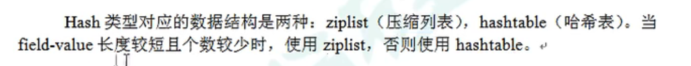

## 一、字符串string

### 1.1 常用命令

1. set   <key> <value> : 插入一个键值对，如果key已经存在，新的value会覆盖原来的value

 	2. get <key> ：查询某个键对应的值
 	3. append <key> <value> : 将给定的value添加到原值的末尾
 	4. strlen <key> : 查询值的长度
 	5. setnx <key> <value> : 当对应的键不存在时，才设置键值对(即不覆盖版本的set)
 	6. incr <key> : 将键对应的数字值+1，只能对数字值起作用，如果原值为空，新增值为1
 	7. decr <key> : 将对应的数字值-1，同上，为空新增值为-1
 	8. incrby/decrby <key> <step> :  将对应的值增加或减少对应的步长
 	9. mset <key1> <value1> <key2> <value2>......   : 同时设置多个键值对
 	10. mget  <key1> <key2> <key3> : 同时查看多个值
 	11. msetnx  <key1> <value1> <key2> <value2>......   : 同时设置多个键值对（不覆盖）
      注：9~11具有原子性，即一个失败就全部失败
 	12. getrange <key> <start> <end> : 获取对应的值中 [start，end]部分
 	13. setrange  <key> <start>  <value> : 将对应的值，在start部分开始替换为value (即覆盖)
 	14. setex : <key> <second> <value> : 设置一个会过期的键值对，单位为秒
 	15. getset <key> <value> : 以新值换旧值，顺便获取旧值

### 1.2 数据结构

​	类似C++中的std::string类。需要注意：字符串最大长度为512M。在Redis中，SDS遵循了C风格字符串的传统，在字符串尾部多分配一个字节并设置为’\0‘，这样的好处是可以使用一部分C库函数处理字符串。

## 二、列表list

### 2.1 简介

​	简单来说就是：单键多值、双向链表、插入可以从左，也可以从右，均为**头插法**

### 2.2 常用命令

1. lpush/rpush  <key>  <value1> <value2>... : 往链表中插入多个值，左头插或右头插

 	2. lpop/rpop  <key> : 从左/右边删除一个值(头删)，当链表中没有值时，对应的键也被销毁
 	3. rpoplpush <key1> <key2> : 从key1对应的链表右边取出一个值，插入到key2对应的链表的左边
 	4. lrange <key> <start> <stop> : 获取链表中的值，从左往右索引，当stop=-1时表示获取从start开始至结束的所有值
 	5.  lindex :  <key> <index> : 获取对应下标的元素(从左往右)
 	6. llen :  <key> : 获取长度
 	7. linsert <key> before/after <value> <newvalue> : 表示在链表中value位置的前或后插入newvalue，注意：前(before)指的是节点右边，后指的是左边。
 	8. lrem  <key> <n> <value> : 从左往右地删除n个value
 	9. lset  <key> <index> <value> : 将对应下标的节点值设置为value

### 2.3 数据结构

​	连续结构的好处就是，可以生下指针的内存

## 三、集合set

### 3.1 简介

​	set的实现是用哈希表实现的，所有的查询时间复杂度都是o(1)，并且set中不会出现重复的元素

### 3.2 常用命令

1. sadd  <key> <value1> <value2>... :  将多个值加入集合中，如果已存在则忽略

 	2. smembers <key> : 取出集合中所有值
 	3. sismember  <key> <value1>:  查看set中是否存在value，如果是返回1，否则返回0
 	4. scard  <key> : 返回集合中元素个数
 	5. serm <key> <value1> <value2>... : 将多个值从set中删除
 	6. spop <key> : 随机从集合中取出一个值
 	7. srandmember <key> <n> : 随机从集合中取出n个值，且不会将值从集合中删除
 	8. smove <key1> <key2> <value>: 将集合k1中的value移动到集合k2
 	9. sinter <key1> <key2>..... : 返回多个集合中交集元素
 	10. sunion <key1> <key2>...... : 返回多个集合中并集元素
 	11. sdiff  <key1> <key2>...... : 返回多个集合中差集元素

## 四、哈希hash

### 4.1 简介

​	Redis中的hash是一个键值对集合，其映射到的是一个filed和value的映射表，也就是说Redis键值对中的值本身又是一个键值对结构。

### 4.2 常用命令

1. hset <key> <filed> <value>   :  往key映射到的映射表中添加键值对(键 - filed  值 - value)

 	2. hget  <key> <filed> ： 取出key映射到的映射表中的filed对应的值
 	3. hmset   <key> <filed> <value>  <filed> <value> .... :  批量往key映射到的映射表添加键值对
 	4. hexists <key> <filed> ： 查看对应的映射表中，是否存在filed键，是返回1，否则返回0
 	5. hkyes <key> : 取出key对应的映射表中所有filed
 	6. hvals <key> :  取出key对应的映射表中所有value
 	7. hincrby <key> <filed> <increment> : 往key对应的映射表中，filed对应的value加上increment
 	8. hsetnx <key> <filed> <value> : 往key对应的映射表中，加上 filed - value的键值对，当且仅当filed不存在时才有效

### 4.3 数据结构

​	在底层实现上，hashtable中的键是不重复的。并且其底层数据结构其实维护了两个哈希表(ht[2])，平时只使用一个，另一个用来辅助执行rehash操作，redis中解决哈希冲突的方式是开链法，即用链表保存哈希值相同的节点。
​	当且仅当以下两个条件中的任意一个被满足时，哈希表执行rehash操作：

1.  服务器当前没有执行BGSAVE命令或BGREWRITEAOF命令，且哈希表负载因子大于1。
2.  服务器在执行BGSAVE或BGREWAITEAOF命令但哈希表负载因子大于5时。

​     在实现上，Redis中的哈希表并不是一次性完成rehash操作，而是采用渐进式rehash的方式，即一次rehash一部分到ht[1]，这样的好处是避免因rehash而引起的服务器阻塞。在渐进式rehash期间，查找、删除、更新操作会在两个表中进行，在表ht[0]中找不到数据时会尝试到ht[1]中查找，而新插入的键值对会一律保存到ht[1]中。
​      rehash完成后，将释放ht[0]的空间，并将ht[1]置为ht[0]。

## 五、有序集合zset

### 5.1 简介

​		zset与set非常相似，是一个没有重复元素的字符串集合。不同之处在于，zset中的元素都与一个评分(score)关联，score被用来排序集合中的成员，成员是不重复的，但score可以是重复的。

### 5.2 常用命令

 	1. zadd <key> <score1> <value1> <score2> <value2>... : 往对应的zset中加入多个value以及value对应的score
 	2. zrange <key> <start> <stop> [WITHSCORES] : 将集合中下标在satrt~stop的value取出，stop为-1时表示取出所有，WITHSCORES是可选项，加上时会把对应的score也取出。
 	3. zrangebyscore <key> <min> <max> [WITHSCORES]:  将集合中score在[min，max]的value取出
 	4. zrevrangebyscore：同上，只不过将score从大到小取出value
 	5. zincrby <key> <increment> <value> : 将集合中，value对应的score加上increment，注意加的是score的值
 	6. zrem <key> <value> : 将集合中，对应的value删除
 	7. zcount <key> <min> <max> : 计算集合中，score范围在[min，max]中的value个数
 	8. zrank <key> <value> : 给出key对应的集合中，value的排名(score越低排名越高，排名从0开始)

### 5.3 数据结构

​	zset底层用到了两个数据结构：第一个是hash，hash将value与score进行关联(即 key -> hash，在hash中有                      value->score)。第二个是跳表，跳表用于给score排序。

## 六 Bitmaps

### 6.1 简介

​	bitmaps本质上不是一种新的数据类型，而是一个字符串，但是它可以对字符串进行位操作。可以把bitmaps想象成是一个以位为单位的数组，每个位都由0/1组成，数据的下标在bitmaps中叫偏移量。

### 6.2 常用命令

 	1. setbit <key> <offset> <value> : 将位图中某个位置1或置0
 	2. getbit <key> <offset> : 获取位图中某个位置的值
 	3. bitcount <key> [strat,end]: 查看位图中为1的位数有多少(可以选定区间，注意：这里的区间的byte区间，例如0，1，表示0~16位，因为一个byte占8位)
 	4. bitop <key> <opt>  <destkey> <key1> <key2>.... :  对多个位图做操作(操作包括逻辑与、或、异或等)，并将结果保存在destkey中

## 七、Hyperloglog

### 7.1 简介

​	hyperloglog可以用极小的内存空间完成对数据基数的统计。

### 7.2 常用命令

1.  pfadd  <key>  <elements> [elements...]  : 加入一个或多个元素，无法重复添加，成功返回1，否则0
2.  pfcount  <key>  : 显式key对应的集合有多少个基数。注：可以同时对多个key操作，显式结果为这些key中的基数个数之和
3.  pfmergr    <destkey> <key1> <key2> ...  ： 将多个key对应的数据结构，整合到destkey中

## 八、Geospatial

### 8.1 简介

### 8.2 常用命令

1.  geoadd <key>  <longitude> <latitude> <member> : 往集合中添加 <经度><纬度><成员名>，可以添加多个
2.  geoops <key> <member> : 获取指定成员的经纬度
3.  geodist <key> <member1> <member2>  [m | km | mi] : 获取两个成员之间的直线距离,单位可选，模式为米
4.  groradius <key>  <longitude> <latitude>  <radius>   [m | km | mi]: 获取某个经纬度，以radius为半径的范围内的成员

​	