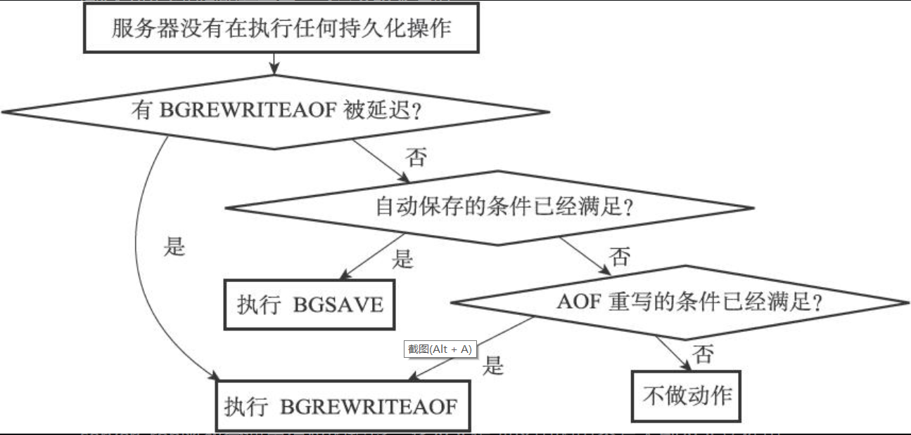

### 一、命令请求的执行过程

1.  读取命令请求：客户端发送命令到服务端时，触发对应的文件事件。将命令读取到redisClient结构中的缓冲区后进行分析，将参数分别填到argv属性里，同时更新argc。
2.  查找命令实现：在服务端的命令表中查找argv[0]对应的redisCommand结构，其中就有命令对应的请求函数。
3.  执行预备操作：现在参数、参数、命令和命令处理函数都有了，在正式执行前需要先做一些预备工作：检查redisClient结构的cmd指针是否指向NULL，是的话代表这个命令找不到对应的redisCommand结构，则向客户端返回错误；根据redisCommand结构的arity属性，检查参数个数是否符合要求；检查客户端是否以及通过身份验证等
4.  调用命令处理函数：命令处理函数都是一个个 void (redisClient*)类型的函数，函数执行完操作之后，会将命令回复保存在客户端结构的缓冲区当中。
5.  执行后续工作：根据执行命令所耗费时长，更新redisCommand结构的milliseconds属性，并将calls属性+1；如果服务端开启AOF功能，将刚刚执行的命令加入AOF缓冲区；如果有其它从服务器正在复制当前服务器，则将刚刚执行的命令传播给所有从服务器
6.  等待可写文件事件，将命令回复返回给客户端

### 二、serverCron函数

​	serverCron函数会每隔100ms执行一次，这也是服务端中为数不多的时间事件之一。这个函数执行的内容为对服务器状态的检查以及更新一些服务器结构(redisServer)中的属性。

1.  更新时间缓存：redisServer中有两个属性：mstime和unixtime，分别是毫秒精度和秒级精度的UNIX时间戳。由于是每隔100ms更新一次，这两个值并不十分准确，只有一些对时间不敏感的操作会使用它们，例如打印日志、服务端LRU时钟、决定是否执行持久化任务等。而在为key设置过期时间这种需要高准确度的功能上，服务端会再次执行系统调用获取准确的当前时间。
2.  更新LRU时钟：每个redis结构中都有一个lru属性，保存对象最后一次被访问的时间。而redisServer中有一个lruclock属性。当要计算一个数据库key的空转时间，就用lruclock减去lru属性即可。注意这个值并不准确
3.  更新服务器每秒钟执行的命令次数：以抽样计算的方式估算命令请求数量。
4.  更新服务器内存峰值：检查服务器进程当前占用内存大小，并与stat_peak_memory属性比较，比它大更新它
5.  处理SIGTERM信号：服务端为这个信号注册了处理函数，其内容为打印日志，并将redisServer结构中的shutdown_assp置为1。随后服务端将进行持久化操作然后关闭。捕捉这个信号的原因就是因为要持久化。
6.  管理客户端资源：对一定数量的redisClient结构做检查：如果连接超时(长时间无互动)则断开连接；如果客户端执行上一次命令后，缓冲区大小超过一定长度，则释放并重新申请一块缓冲区。
7.  管理数据库资源：对一部分数据库进行检查，删除过期键，有必要时进行字典收缩。
8.  执行被延迟的BGREWRITEAOF：在执行BGSAVE期间，客户端向服务器发送的BGREWRITEAOF将被延时执行，redisServer的aof_rewirte_scheduled标识记录了是否延迟该命令。如果此时BGSAVE命令没在执行，则进行rewrite aof操作。
9.  检查持久化操作的运行状态：redisServer结构中的rdb_child_pid属性和aof_child_pid属性记录了执行BGSAVE或BGREWRITEAOF操作的子进程的pid，如果当前没在执行则为-1。如果这两个值其中一个不为-1，服务端执行一次wait3函数检查是否有来自子进程的信号，如果有就执行对应操作，例如将新的RBD/AOF文件替换掉旧的。      假如两个持久化操作都没有执行中，则检查是否有aof重写操作被延迟、检查持久化条件是否满足、检查aof重写条件是否满足：
10.  将AOF缓冲区中内容写入AOF文件：aof重写过程中的写命令，会被缓存起来，等子进程发信号表示重写完成时再将缓存的命令写入新的AOF文件。

### 三、初始化服务器

	1. 初始化服务器状态结构：创建一个redisServer类型的实例变量。并做一些初始化工作，如：设置服务器默认端口号、创建命令表、初始化LRU时钟。
 	2. 载入配置选项：根据启动服务器时的配置参数或配置文件，修改服务器中的默认配置，例如端口号、数据库个数
 	3. 初始化服务器数据结构：例如server.db数组、server.clients链表以及设置进程信号处理器等
 	4. 还原数据库状态：根据配置来决定使用RBD/AOF文件恢复数据库状态。