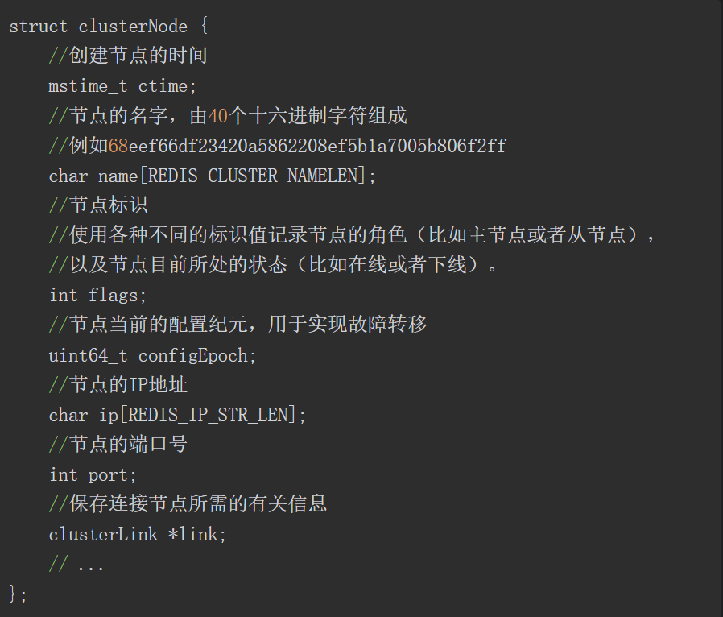
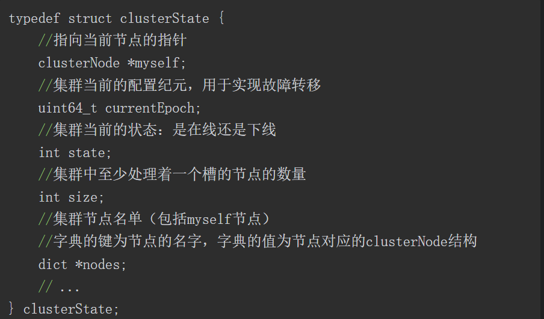
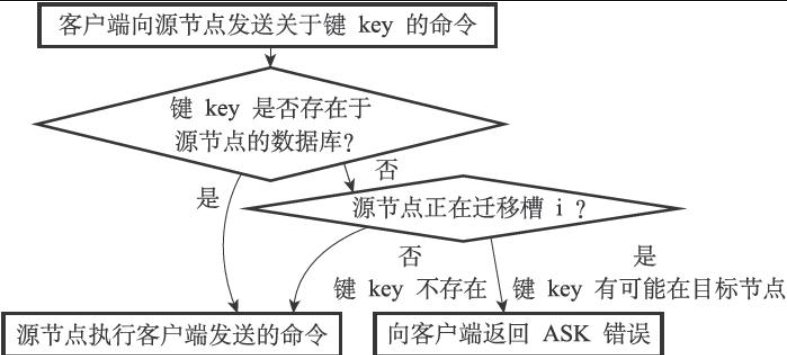
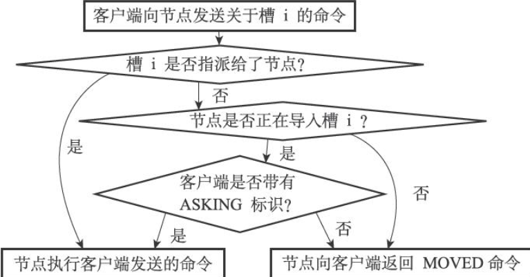

### 一、简介

​	集群是Redis的分布式数据库方案，通过分片进行数据共享，并提供复制和故障转移功能。

### 二、节点

​	一个Redis集群通常由多个节点组成，每个节点都是一个Redis服务端进程，只不过通过配置文件的cluster-enable选项将其配置为集群节点后跑的代码有点不一样。在最开始的时候，每个节点都是相互独立的，都处于一个只包括自己的集群当中。用CLUSTER MEET命令可以让节点另一个节点加到当前的集群当中。

#### 2.1 节点启动

​	节点启动后，不仅有redisServer结构来保存服务器状态、redisClient结构来保存客户端状态，还会创建一个clusterNode结构和clusterState结构保存节点相关信息：

clusterNode结构用于保存一个节点的信息，Redis节点不仅会为自己创建clusterNode结构，还会为与其连接的、集群中的其它节点创建clusterNode结构，clusterState结构用于管理这多个clusterNode结构。

#### 2.2 CLUSTER MEET命令

​	命令的格式为 CLUSTER MEET <IP> <PORT>。通过向节点A发送该命令，可以令A与另外一个节点B进行握手。步骤如下：

*   A会为B创建一个clusterNode结构，并添加到clusterState的nodes字典当中，之后A根据命令中的端口号和IP地址向B发送一条MEET消息。
*   B收到A的MEET消息，为A创建一个clusterNode结构，并同样添加到字典当中，然后向A返回一条PONG消息。
*   A收到B的PONG消息，就知道B已经成功接收了自己的MEET消息，之后A向B返回PING消息
*   B收到PING消息后知道A已经接收到了PONG消息，握手完成！
*   之后A会将B的信息传播给集群中的其它节点，让其它节点也与B握手。

### 三、槽指派

​	所谓槽是一个抽象的概念，并不是说真的弄了个容器。**Redis集群中，一个槽本质上就是一个数字**，数据库中数据的key经过一个函数的计算后可以得到一个数字，那么就说这个键值对属于这个数字，也就是属于这个槽。Redis集群一共有16384个槽，每个节点可以负责处理若干个槽。当数据库中16384个槽都有节点在负责处理时，集群处于上线状态，否则集群处于下线状态。可以用命令CLUSTER ADDSLOTS命令指派一个或多个槽。

#### 3.1 节点如何记录自己负责的槽

​	在clusterNode结构中，有一个数组：unsigned char slots [16384/8]和一个整数numslots用于记录槽。slots的作用是一个二进制数组，其每一位代表着对应的槽是否被当前节点处理，因此大小是16384/8。

#### 3.2 传播节点的槽指派信息

​	一个节点除了记录自己的槽信息，还要记录集群中其它节点的槽信息。因此每个节点会将自己的槽信息，也就是slots数组发给集群中的其它节点，其它节点拿到这个数组后将其保存在clusterState结构中对应的源节点的clusterNode结构中。

#### 3.3 如何快速知道某个槽属于哪个节点

​	仅仅依靠clusterNode结构中的slots数组无法快速判断某个槽是否被分配以及由哪个节点负责。而解决方案就是在clusterState结构中接入一个数组：clusterNode* slots[16384]。这个数组用于记录某个槽是被哪个节点处理，如果没有则为NULL，有则指向这个节点对应的clusterNode结构。

#### 3.4 CLUSTER ADDSLOTS命令的实现

​	这个命令接收一个或多个槽作为参数，例如 CLUSTER ADDSLOTS 1 2  代表将槽1和2分配给当前节点处理。执行这个命令时，首先检查输入的槽是否已经被分配，只要有一个是，则向客户端返回错误并终止命令执行。然后遍历所有输入槽，将其指派给当前节点。最后，执行完毕时发消息告诉集群中的其它节点，自己目前正在处理哪些槽。

### 四、集群节点执行命令

​	客户端向某个节点发送命令去操作某个键值对时，节点首先根据key算出键值对属于哪个槽，然后判断这个槽是不是由自己负责，如果是则正常处理命令，否则向客户端返回MOVED错误。这个MOVED错误对于集群模式的redis-cli客户端，将会被隐藏，而是根据MOVED错误自动进行节点转向(转向槽所对应的节点)，并打印出转向信息。而如果是单机模式的客户端，则MOVED错误会被打印出来。
​	集群模式的客户端一般与集群中的所有节点都有连接，节点转向本质上就是换一个TCP套接字进行通信。

​	集群节点与单机服务器最大的区别就是，节点只能使用数据库当中的0号数据库。并且在节点的clusterState结构中，有一个slot_to_keys跳表将槽与数据的key进行关联。

### 五、重新分片

​	集群的重新分片操作可以任意数量的已分配给某个节点的槽改为分配给另外一个节点。并且跟这个槽相关的键值对数据也会一并转移到目标节点(通过slots_to_keys实现)，分片操作是在线完成的，分片过程中集群依然可以正常处理客户端的命令。

#### 5.1 实现过程

​	Redis集群的分片操作由Redis官方提供的一个集群管理软件redis-trib负责执行，它通过向源节点和目标节点发送命令进行重新分片操作，其对单个槽的重新分片过程如下：

*   对目标节点发送 CLUSTER SETSLOT <SLOT> IMPORTING <SOURCE_ID> 命令，让目标节点准备好从源节点导入属于槽slot的键值对。source_id是源节点的id
*   向源节点发送 CLUSTER SETSLOT <SLOT> MIGRATING <TARGET_ID> 命令，让源节点准备好将属于槽slot的键值对迁移到目标节点。
*   向源节点发送 CLUSTER GETKEYSINSLOT <SLOT> <COUNT> 命令，获取最多count个属于slot的键值对的key
*   对于步骤3所获取到的每一个key，redis-trib都向源节点发送命令 MIGRATE <TARGET_IP> <TARGET_PORT> <KEY_NAME> 0 <TIME_OUT> 命令，将key对应键值对原子地从源节点迁移到目标节点。
*   重复执行步骤3和步骤4，直到源节点的slot对应的键值对都迁移完成。
*   redis-trib向集群中**任意一个节点**发送 CLUSTER SETSLOT <SLOT> NODE <TARGE_ID> 命令，将槽slot指派给目标节点。这一指派信息会发送到整个集群，最终集群中的所有节点都会知道slot被指派给了目标节点

#### 5.2 重新分片过程中节点如何处理与slot相关的命令

​	重新分片过程中，可能出现这种情况：分片分到一半，slot对应的键值对一部分位于源节点，一部分位于目标节点。但是此时槽依然是归源节点处理的，因此客户端的命令也会给到源节点。源节点收到命令后就在自己的数据库中找，如果没找到，那么有可能这个键值对已经迁移到目标节点，此时向客户端返回一个ASK错误。

​	而客户端收到ASK错误后，会被转向目标节点，然后再给目标节点发送相同命令。这个过程跟MOVED错误的处理方式很相似。但细节上有所不同：客户端收到ACK错误后，会根据信息中的ip地址与端口号转向目标节点，但不会一上来就发送原本的操作键值对的命令，而是先发送ASKING命令
​	ASKING命令会把服务端中，这个客户端对应的redisClient结构的flag中或上 REDIS_ASKING标志。因为一般情况下如果客户端向节点发送命令操作某个槽的数据，而这个槽不归属于当前节点，将返回MOVED错误，但此时重新分片的特殊情况，REDIS_ASKING标志位能够让节点破例一次执行对应命令。注意这个ASKING命令的作用是一次性的。当节点执行了带有REDIS_ASKING标识的客户端的一次命令后，这个标识就会被移除。

### 六、复制与故障转移

​	Redis集群中的节点分为主节点和从节点，主节点指的是处理若干个槽的节点，而从节点用于复制主节点，并在主节点下线时代替它继续处理命令请求。

#### 6.1 设置从节点

​	向某个节点发送命令 CLUSTER REPLICATE <node_id>可以让收到命令的节点成为node_id的从节点，并开始对主节点进行复制。clusterSatte.myself.slaveof是一个指向clusterNode结构的指针，收到命令后从节点将这个指针指向主节点对应的结构。而相对应的，clusterNode结构还有一个slaves成员，它是一个数组，每个数组成员都是指向clusterNode结构的指针，指向该节点的从节点。
​	一个节点成为从节点并开始复制主节点这一信息会发送给集群中的其它节点，最终集群中的所有节点都知道某个节点正在复制某个主节点。

#### 6.2 故障检测

​	集群中每个节点会定期向集群中的其它节点发送PING消息，如果对方没有在规定时间内返回PONG消息，则发送方将接收方标记为疑似下线PFAIL。集群中的各个节点会互相发消息交换集群中各个节点的状态信息，当一个节点A收到来自B的消息，认为C进入了疑似下线状态时，A会在C对应的clusterNode结构中记录下这一信息。
​	如果半数以上的主节点都认为某个主节点疑似下线，那么这个主节点X被认为已下线(FAIL)，将主节点X标记为已下线的节点，会立即在集群中广播这一消息，所有收到消息的节点都将X标记为已下线。

#### 6.3 故障转移

​	当从节点发现自己复制的主节点下线时，从节点中会有一个被选中，然后指向SALVEOF no one命令，成为新的主节点。新的主节点会将下线的那个主节点所负责的槽全部指派给自己，然后在集群中广播一条PONG消息，让集群中其它成员知道这个节点已经成为新的主节点，并接管原本已下线的主节点负责的槽。
​	在从节点中选举新的主节点的过程如下：

1.  集群的配置纪元是一个自增计数器，初始值为0，集群中每一次的故障转移都会使得配置纪元整体+1，在每个纪元中，主节点有一次投票机会。
2.  当从节点发现自己的主节点下线，会向集群广播CLUSTERMSG_TYPE_FAILOVER_AUTH_REQUEST消息，要求收到这条消息的主节点给自己投票
3.  主节点将给第一次收到消息的从节点投票，并且只能投票一次，后续再收到投票请求时将不予处理。主节点会给它投票的那个从节点回复CLUSTERMSG_TYPE_FAILOVER_AUTH_ACK消息，告诉对方自己投票给它，从节点收到这个消息后就可以统计自己的票数。
4.  集群中有N个可投票的主节点，那么从节点收到N/2+1票后就当选为新的主节点。

### 七、集群中常见的消息类型及其作用

	1. MEET消息：发送者收到来自客户端的CLUSTER MEET命令时，会像接收者发送MEET消息，邀请接收者加入自己当前的集群，
 	2. PING消息：集群里的每个节点默认每隔一秒钟就会从已知节点列表中随机挑选5个节点，然后给这5个节点中最长时间没有发送过PING消息的节点发送PING消息，以此检测它是否在线。初次之外，如果节点最后一次返回PONG消息的时间超过规定时间，也会给这个节点发送PING消息，防止因为没有随机到而某些节点的消息滞后。
 	3. PONG消息：接收者接到MEET消息或PING消息时会返回PONG消息，表示消息已接收，同时让其它节点更新关于自己的信息。一个节点也可以主动向集群广播PONG消息，例如故障转移完成后的新主节点。