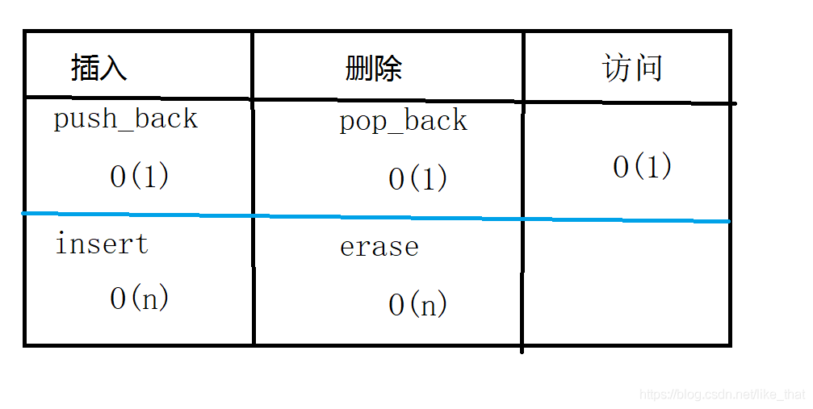
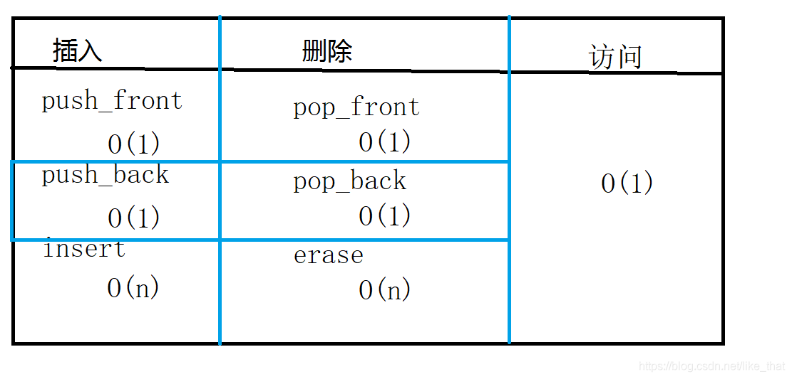
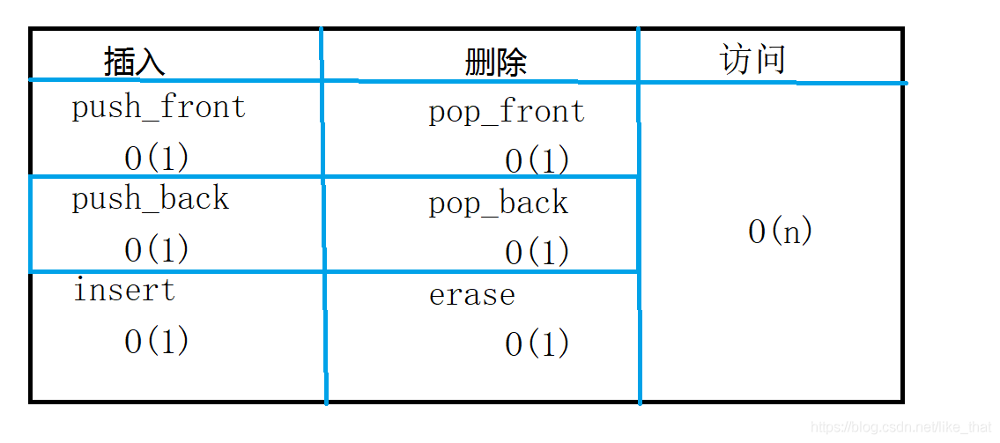

### 1. vector的扩容

​	vector是一种动态数组，每次分配空间都不知额外分配一个，而是以当前容量的2或1.5倍进行扩容，扩容后将原内存中的数据移动到新申请的内存中，再释放原内存，因此扩容之后有可能会导致程序中的迭代器失效。按照摊还分析，连续插入N个元素，每次插入的时间复杂度为O(1)。

### 2. vector迭代器失效的情况

1. 插入操作引起的内存扩充。

 	2. 删除元素。erase函数将返回删除元素后下一个有效的迭代器。

### 3. list底层

​	STL中list是一个双向环状链表，与vector不同的是，list的内存分布是不连续的，只能通过指针访问数据，因此在list中如果随机访问某个数据，其时间复杂度在O(N)。不过list的优势在于，其插入和删除都非常高效。

### 4. deque底层

​	deque是一种双端队列，支持在队头和队尾进行插入删除操作。它的内存分布为多块连续的缓冲区，由一个叫map的指针数组来存储指向这些缓冲区的指针

### 5. vector、deque、list三者增删查的时间复杂度

1.  vecto：  

2.  deque：  

3.  list：  

### 6. map与unordered_map的区别

​	前者的底层实现是红黑树，后者是哈希表，前者中存储的元素是有序的，后者存储的元素是无序的。

