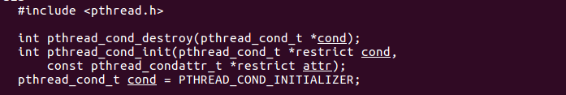

## 一、基本概念和内核实现

### 1.1 基本概念

​	线程只能由进程产生，但CPU可以单独为进程分配资源，一个进程如果分为多个线程，就能提高程序运行效率


### 1.2 内核实现

​	

### 1.3  线程之间共享与不共享、进程优缺点

​	1. 共享：

2.  不共享：

3.  优缺点：

## 二、进程控制原语

### 	2.1 pthread_self函数

​	用于查看线程id，注意：**线程id与线程号不一样，前者用于在进程内分辨不同线程，后者用于CPU为线程分配资源**。

​	其返回值类型为pthread_t，也即unsigned long，注意，用线程库函数后在编译时需要加上参数 -pthread。

### 2.2 pthread_create

	该函数用于创建线程，参数作用为： 1. thread：传出参数，用于记录创建出的线程的id，当创建失败时该变量未定义。  2.  attr：线程的属性设置，传入NULL时使用默认属性。 3. start_routine：进程所需要执行的函数，其参数和返回值都为void *，进程一旦创建将运行这个函数。  4.  arg：参数三指向的函数所需要的参数。    返回值：创建成功时返回0，否则返回其它错误码，用返回值来做错误判断时需要特别注意。

### 2.3 pthread_exit


	该函数用于线程退出，线程的退出与进程不同，如果使用exit函数，退出的将是整个进程，此时所有的线程都会退出，如果使用的是return，在线程回调函数以及回调函数所调用的函数中使用是没问题的，但如果在main函数中使用，也会使得整个进程退出，进而导致所有线程退出，因为return的含义是返回调用端，因此，**退出线程时尽量在线程回调函数中使用pthread_exit函数，main函数中使用return时注意是否需要加sleep函数等待其它线程执行完毕**

### 2.4 pthread_join


	该函数用于回收子线程，并通过变量retval获取子线程退出值(即函数pthread_exit的参数)，另一个参数是要要回收的子线程的线程id。类似于回收进程的wait函数，它将阻塞地等待线程执行完毕并进行回收。

### 2.5 pthread_detach

​	

​	该函数用于将线程分离。与进程相似，如果线程退出后没有进行回收，将变成僵尸线程，但如果将线程从原进程中分离，那么当它执行完毕时会自动回收资源，同时原进程中其它线程也无法对该分离线程进行回收。

### 2.6 pthread_cancel


​	该函数用于杀死线程，被杀的线程回收时，join函数的传出参数固定是-1。

## 三、线程同步概念及各种锁

### 3.1 线程同步概念

​	同一进程下的线程共享各种资源，包括各个全局变量、文件描述符（包括标准输入输出等），且线程之间对这些资源的使用是竞争的，也就是说，如果不对线程使用共享资源进行同步，就有可能出现多个进程在各自的CPU时间内对同一份资源进行使用与修改，最终资源可能被线程A改了一部分，又被线程B改了一部分，最终结果混乱。而解决这种现象的方法就是给资源加上锁，一个线程使用资源时，首先必须进行lock，如果它在使用过程中失去CPU，而其它线程试图访问这个资源时，就会由于不持有锁而访问失败。

### 3.2 互斥量及其操作函数

​	互斥量是Linux系统提供的一把锁，线程尝试对资源进行操作前，要先进行加锁操作，成功了才能继续执行，否则就代表有其它线程正在使用该资源，于是阻塞等待锁释放。当然这种规则要依托于程序员实现，如果编写了一个线程，不按照这种规则先进行加锁操作，而是之间访问资源，也是可以的，只是结果可能会混乱而已，这里的锁并不属于语言内部特性，而是代码编写者自己约定的东西，而这个互斥量，本质上也只是个结构体而已。

1.  pthread_mutex_init：用于创建互斥量的函数，第一个参数为传出参数，关键字restrict可以防止其它指针修改mutex，至于后一个参数，是设置互斥量的属性的，一般设置为NULL
    	

2.  pthread_mutex_destory：用于销毁互斥量，将创建时获得的传出参数传进去即可。
3.   pthread_mutex_ lock、 pthread_mutex_ unlock：这两个函数用于获得锁与释放锁，注意lock是阻塞的，一旦没有成功获得锁，将阻塞等待其它线程释放锁。应当尽量**减小锁操作的粒度**，也即，当在线程调用函数中使用完资源后，应当立即执行释放锁的操作。
4.   pthread_mutex_ trylock：与lock类似，这个函数用于获得锁，但如果未能成功，它不会阻塞，而是放弃线程拥有的所有锁。

### 3.3 死锁

​	死锁指的是由于代码逻辑，导致某个线程永远阻塞在等待资源释放。第一种情况是unlock函数写成lock函数，第二种情况是A拥有锁1，想再尝试获得锁2，同时B拥有锁2，想再尝试获得锁1，这种情况下如果线程AB使用lock函数，将因为想要获取的资源在对方手上而永远阻塞，解决方法就是使用trylock。

### 3.4 读写锁及其操作函数

​	读写锁是一种不同于互斥量的锁，它可以有两种锁住的状态，即读锁和写锁，遵循两个规则：1. 写独占，读共享：假如线程A对资源进行读锁，而后有BCD同样请求对资源进行读锁，是可以通过的，因为读锁是可以共享的，但，只要其中有一个是写锁就不行。而如果A是写锁，那么其它线程无论是想要进行读锁还是进行写锁，都不允许共享，要等待A释放。  2.  写锁优先级高：多个线程等待资源释放时，尝试进行写锁的线程将更有限获得资源。
​	读写锁有专属于自己的操作函数，与互斥量的操作函数相似，包括init、destroy、lock、unlock、trylock，不同的是，lock与trylock有读写之分

## 四、条件变量与生产者-消费者模型

​	C/S加构的服务器大多基于响应请求的模式来处理客户端的需求，服务器可以用生产者-消费者模型来应对多个客户端的请求：在客户端进程中，有一些线程(或进程)用于**接收客户端的请求，并将消息压入消息队列中**，这些线程被称为**生产者**，而有一些线程(或进程)用于**处理消息队列中的任务**，这些线程被称为**消费者**。
​	所以这种模式下，会有很多进程对消息队列进行操作，为了确保操作的正确性，可以给这个消息队列加上互斥锁。但是这里存在一个效率问题，**消费者线程只是循环获得锁，然后判断消息队列是否有消息**。大多数时候队列可能是没有消息的，这样就比较浪费运算了。**最好的情况是这样的，消费者线程判断队列没有消息后，进入休眠状态，直到有别的线程告诉它有消息了才醒过来，此时消费者继续取消息来处理**。条件变量就能满足这样的要求。
​	条件变量也是一个变量，将它和一个互斥量绑定使用，例如上述的消息队列锁，当不满足条件变量时，**释放该锁并阻塞等待，满足后加上锁并开始执行任务**。

	### 4.1 条件变量初始化与摧毁


	可以看到，**pthread_t是条件变量的类型**，初始化时第一个变量为传出参数，第二个为对条件变量的设置，默认设置就传NULL。摧毁条件变量时也只需传入指向条件变量的指针。**这两个函数都是成功返回0，失败返回-1**。最后一行是一种特殊的初始化方式，与默认设置下的调用初始化函数的作用相同。

### 4.2 等待条件变量满足：pthread_cond_wait

​	
​	阻塞等待条件变量满足，传入的参数为**指向条件变量和互斥量的指针**。成功返回0。注意，这里的条件变量并不是说可以直接取代逻辑上的条件变量，例如消费者线程，需要在队列不为空的时候才满足该条件变量，而当生产者线程往队列中添加任务的时候，**在逻辑上**就满足了队列不为空的条件变量，此时就可以**执行唤醒函数来唤醒阻塞在wait函数中的线程**。换句话说，条件变量及其操作函数只是辅助完成代码逻辑，本质上的逻辑设计没法自动完成，还得靠代码编写者自己安排，包括什么时候调用这个函数，也是写代码的人自己安排，例如要在调用它之前加一个对队列中元素个数的判断，为0时才符合调用它的条件。
​	在调用该函数时，会

### 4.3 唤醒阻塞的条件变量


	第一个函数唤醒所有阻塞中的线程，第二个函数只唤醒一个线程

## 五、线程池

​	当CS模型中，当客户端发送请求时，服务器进程创建一个线程(或进程)去提供服务，服务执行完毕后销毁，当有下一个请求来临时，再重新创建一个新线程去提供服务，然后再销毁。这样反复的对线程进行创建和销毁，十分浪费资源，线程池正是为了改变这种情况而产生的。
​	线程池的思想就是提前开辟一片空间预备用于存储线程的pid、回调函数等，并设置**可存在的最大线程数、最小线程数、任务队列大小**等属性，每次保证有至少min_thr_num个线程存在，它们可以不工作，阻塞等待任务。当然，线程池也要负责动态地调整线程个数，具体如何调整要根据任务数、存活线程数、忙碌中的线程数来决定，可以有不同的标准。然后主线程可以只负责接收响应并向任务队列中存放任务，调整线程根据任务量动态增加或删除线程，这样就能一定程度上减少资源的浪费。

### 5.1 用于创建线程池的结构体

```c
struct pthreadpool_task{   //这个结构体是任务队列的元素，换言之，任务队列由一个个这种结构体组成
	void *arg;			  //可以看到，结构体中包含了一个回调函数指针和参数，都是泛型指针
	void *(*function)(void*);//回调函数代表线程需要向客户端提供什么样的服务
};

struct threadpool{

	pthread_mutex_t lock;   //互斥量，用来锁住整个线程池
	pthread_mutex_t thread_counter; //互斥量，只是用于锁住busy_num这个变量
	pthread_cond_t queue_not_full; //条件变量，当满足队列未满时唤醒阻塞的生产者线程来添加任务
	pthread_cond_t queue_not_empty;//条件变量，当满足时唤醒阻塞的消费者线程来领取任务

	pthread_t* threads;//指向线程池中线程id数组的指针，注意是id数组，需要用malloc申请和memset清0
	pthread_t adjust_tid;//线程id变量，用于调整线程(adjust)
	struct pthreadpool_task * task_queue;//指向任务队列的指针，本质上是用数组实现，采用模最大值的方式
										//实现队列的FIFO
	int max_num;//最大线程数
	int min_num;//最小线程数
	int live_num;//目前存活的线程数
	int busy_num;//执行任务中的线程数
	int wait_exit_num;//需要退出的线程数(由adjust线程决定)

	int queue_front;//队列头
	int queue_rear;//队列尾
	int queue_size;//队列元素个数
	int queue_max_size;//队列元素上限
	
	bool shutdown;//bool值，为true时表示要关闭整个线程池
};
```

	### 5.2 初始化线程池

```c
struct threadpool* threadpoolcreate(int minthr,int maxthr,int maxtask){//传入的参数指定线程上下限等
	struct threadpool* pool=NULL;
	do{  //do while(0)，用于当任何一步内存申请出错时直接不执行后面的语句，free掉然后return NULL
		pool=(struct threadpool*)malloc(sizeof(struct threadpool));//内存申请
		if(pool==NULL){
			printf("create fail\n");
			break;
		}


		pool->threads=(pthread_t*)malloc(sizeof(pthread_t)*maxthr);//内存申请，存放tid的数组
		if(pool->threads==NULL){
			printf("create fail\n");
			break;
		}
		memset(pool->threads,0,sizeof(pthread_t)*maxthr);//清0
		//内存申请：任务队列
		pool->task_queue=(struct threadpool_task*)malloc(sizeof(struct pthreadpool_task)*maxtask);
		if(pool->task_queue==NULL){
			printf("create fail\n");
			break;
		}

		//根据参数设置线程数目等初始化参数
		pool->max_num=maxthr;
		pool->min_num=minthr;
		pool->live_num=pool->busy_num=pool->wait_exit_num=0;//还没开始工作，自然设置为0

		pool->queue_front=pool->queue_rear=pool->queue_size=0;
		pool->queue_max_size=maxtask;
		
		pool->shutdown=false;
		//初始化互斥量以及条件变量，任何一个函数执行失败都break掉
		if(pthread_mutex_init(&pool->lock,NULL)!=0||
		   pthread_mutex_init(&pool->thread_counter,NULL)!=0||
		   pthread_cond_init(&pool->queue_not_full,NULL)!=0||
		   pthread_cond_init(&pool->queue_not_empty,NULL)){
			printf("create fail\n");
			break;
		 }
		//根据最小数量创建线程，传入的参数依次为 tid(传入参数)，设置(默认NULL)，线程回调函数，参数
		for(int i=0;i<minthr;i++){
			pthread_create(&pool->threads[i],NULL,thread_function,(void*)pool);
		}
		//创建adjust线程
		pthread_create(&pool->adjust_tid,NULL,adjust_function,(void*)pool);
		
        //注意上面创建线程时，传入的回调函数并不是任务队列中结构体的函数，而是我们自定义的函数
        //至于任务队列结构体成员中的回调函数，将在这个函数中被取出和执行！！！(如果有任务来的话)
		return pool;
	}while(0);
	free(pool);
	return NULL;
}
```

### 5.3 回调函数

```c
void* thread_function(void* arg){
	//接收的函数为指向线程池的指针
    //为什么需要这个指向线程池的指针呢？  
    //1. 需要取任务队列中的元素，而指向任务队列的指针存放在结构体里
    //2. 对线程池进行操作，需要加锁
    //3. 需要条件变量，同样存放在线程池结构体里
	struct threadpool* pool=(struct threadpool*)arg;
	struct pthreadpool_task  task;


	while(true){
		pthread_mutex_lock(&pool->lock);//加锁

		while(pool->queue_size==0&&!pool->shutdown){//当没任务且不关闭线程池时，进入阻塞
			//没任务、阻塞等待任务
			pthread_cond_wait(&pool->queue_not_empty,&pool->lock);
			//这里是设计上的一点小技巧，即：唤醒消费者线程不一定是为了执行任务，也可能是为了消灭线程
			if(pool->wait_exit_num>0){//当要消灭一部分空闲线程时，设置这个值不为0并唤醒线程
				if(pool->live_num>pool->min_num){
					printf("exit thread\n");
					pool->wait_exit_num--;
					pthread_mutex_unlock(&pool->lock);//退出线程后别忘了释放锁！！！
					pthread_exit(NULL);
				}else
					pool->wait_exit_num=0;
			
			}
		}
		if(pool->shutdown){//当要关闭线程池时，就不执行任务了，直接关闭本线程，同样注意释放锁
			pthread_mutex_unlock(&pool->lock);
			pthread_exit(NULL);
		}
		//那么到这一步，就是要从任务队列中取任务了
		task.function=pool->task_queue[pool->queue_front].function;//取任务
		task.arg=pool->task_queue[pool->queue_front].arg;//取参数
		pool->queue_front=(pool->queue_front+1)%pool->queue_max_size;//调整队列
		pool->queue_size--;

		pthread_cond_broadcast(&pool->queue_not_full);//此时就满足条件变量：队列未满，进行唤醒操作
        											//当然此时也不一定有生产者在阻塞
		pthread_mutex_unlock(&pool->lock); //去完之后就完成对线程池的操作了，马上释放该锁！！！！

		//这里的锁只针对busy_num,因为要开始做任务了，调整忙碌线程数目
		pthread_mutex_lock(&pool->thread_counter);
		pool->busy_num++;
		pthread_mutex_unlock(&pool->thread_counter);
		//(*(task.function))(task.arg);
		task.function(task.arg);//调用任务队列中携带的回调函数
		pthread_mutex_lock(&pool->thread_counter);//完成任务、调整忙碌线程数
		pool->busy_num--;
		pthread_mutex_unlock(&pool->thread_counter);
	
	}
	pthread_exit(NULL);
	return NULL;
}
```

### 5.3 生产者添加任务

```c
int addtask(struct threadpool*pool,void*(*function)(void*),void* arg){

	pthread_mutex_lock(&pool->lock);//第一步仍热是加锁
	while(pool->queue_size==pool->queue_max_size&&!pool->shutdown){//队列满时阻塞等条件变量满足
		pthread_cond_wait(&pool->queue_not_full,&pool->lock);
	}

	if(pool->shutdown){//要关闭线程池时直接唤醒所有消费者线程
		pthread_cond_broadcast(&pool->queue_not_empty);
	}
	//在往队列中放置任务前，先将队列中对应结构体的存储参数的那个区域清空并指向NULL
	if(pool->task_queue[pool->queue_rear].arg!=NULL){
		free(pool->task_queue[pool->queue_rear].arg);
		pool->task_queue[pool->queue_rear].arg=NULL;
	}
    
	pool->task_queue[pool->queue_rear].function=function;//往队列中存任务
	pool->task_queue[pool->queue_rear].arg=arg;//存任务参数
	pool->queue_rear=(pool->queue_rear+1)%pool->queue_max_size;//调整队列大小与队尾
	pool->queue_size++;
	pthread_cond_signal(&pool->queue_not_empty);//添加完任务后，满足不为空的条件变量1，唤醒
	pthread_mutex_unlock(&pool->lock);//别忘了解锁
	return 0;
}
```

### 5.4 调整线程

```c
void *adjust_function(void* arg){
	struct threadpool* pool=(struct threadpool*)arg;//其参数同样是指向线程池的指针
	sleep(5);//使得调整频率不那么高，给生产者和消费者时间处理任务
		while(!pool->shutdown){//不关闭线程池时才调整
		pthread_mutex_lock(&pool->lock);//加锁！！！！！！！！！！！！！
		int live=pool->live_num;//将必要的数据取出来，作为后续调整的依据
		int tasks=pool->queue_size;
		int max=pool->max_num;
		pthread_mutex_unlock(&pool->lock);//拿完数据就解锁！！！！！！！！！！

		pthread_mutex_lock(&pool->thread_counter);//针对busy的加锁和解锁
		int busy=pool->busy_num;
		pthread_mutex_unlock(&pool->thread_counter);
	
		if(busy<tasks&&live<max){//某个标准，不重要，满足它了就创建新线程
			int add=0;
			pthread_mutex_lock(&pool->lock);//加锁
            //注意这里是用add记录新增了多少个，而不是用i，因为pool->thread[i]不一定能用
			for(int i=0;add<THREAD_CHANGE_VAR&&pool->live_num<max;i++){
				if(pool->threads[i]==0||!is_threadalive(pool->threads[i])){
					pthread_create(&pool->threads[i],NULL,thread_function,(void*)pool);
					pool->live_num++;
					add++;
				}
			}
			pthread_mutex_unlock(&pool->lock);//解锁
			return NULL;
		}
	
		if(tasks<live&&live-busy>=THREAD_CHANGE_VAR){//某个标准，满足了就杀线程
			pthread_mutex_lock(&pool->lock);
			pool->wait_exit_num=THREAD_CHANGE_VAR;//这里就用到那个小技巧了，设置这个值然后唤醒消费者
			pthread_mutex_unlock(&pool->lock);    //(这里缺少了唤醒的代码。。。。解锁后再唤醒)
		}
		return NULL;
	}
}
	
```

