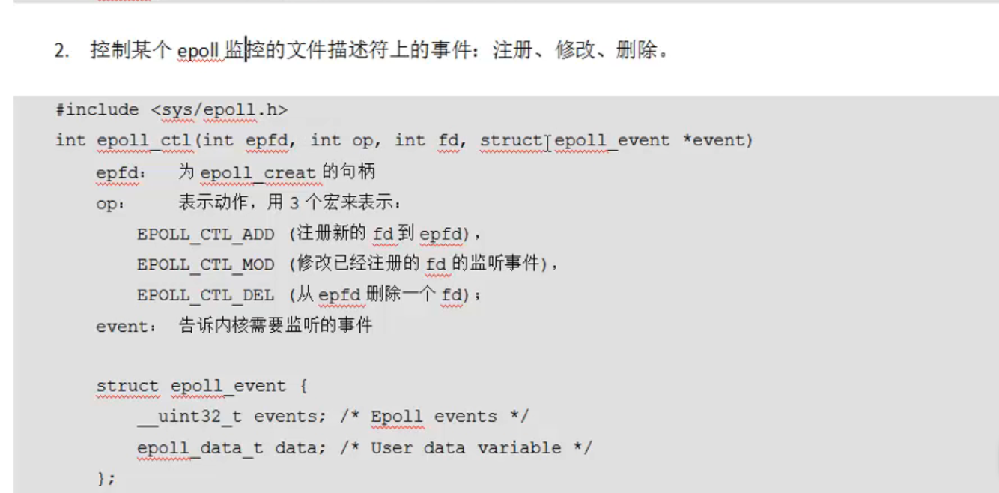
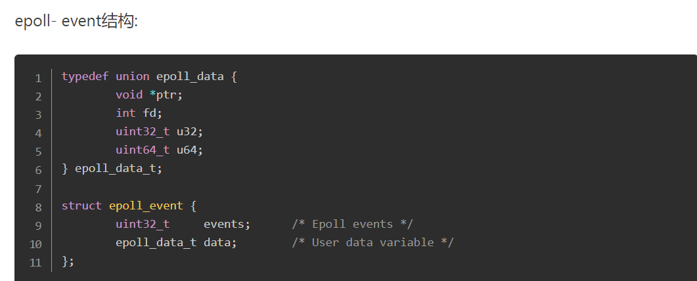
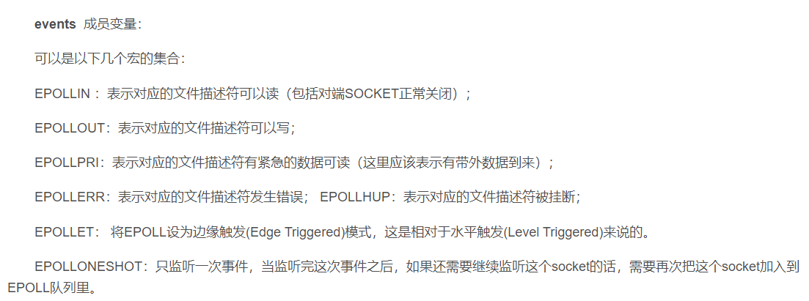
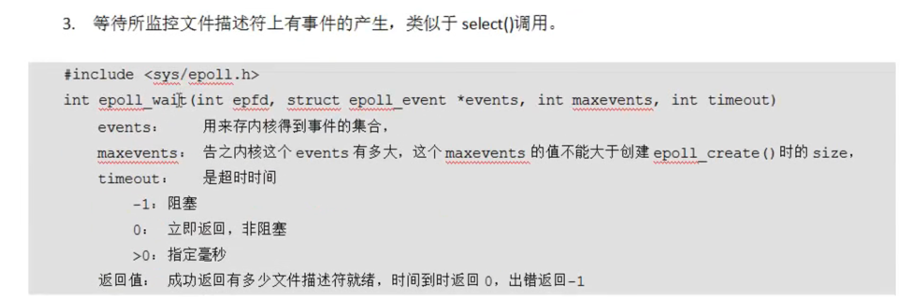
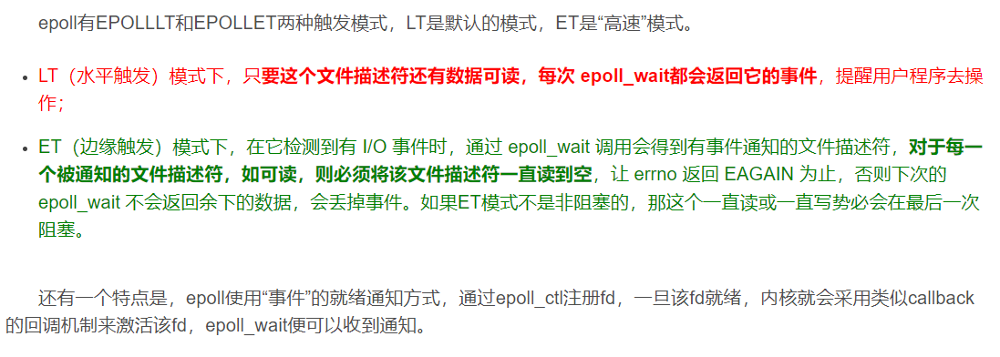
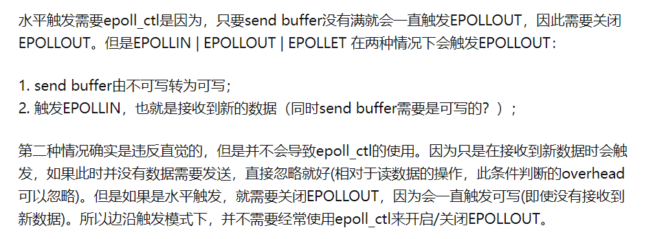

## 一、Socket编程

### 1.1 socket相关概念

​	在Linux系统中，socket也属于文件的一种(不占用内存的伪文件)，与管道类似，但一个管道文件将有两个文件描述符，一个对应读端，一个对应写端，而socket文件没有，它用一个文件描述符完成读写，因此是一种全双工的通信方式。socket将ip地址与端口号绑定，使得一个套接字文件可以绑定网络中唯一的一台主机上的一个进程。


### 1.2 网络字节序

​	实际上就是对于同一个数字，其高位对应地址高位，和高位对应地址低位这两种不同的存储方式使得数据表现不同，因此对于要发送到网络上的数据需要转换，从网络上接收到的数据也要进行转换


​	用户表示IP地址的方式叫点分十进制，例如 192.168.150.129，这样的形式在代码中属于字符串，但上面的htonl函数的参数是个uint32，所以要先将其转换为数字，再转换为网络字节序。 为了方便，Linux系统提供了inet_pton函数，有三个参数**第一个是af，表示使用ipv4还是ipv6，用宏定义来选择；第二个是const char*类型，表示传入的ip地址字符串，第三个参数是void * 类型的，作为传出参数，表示转换好了的网络字节序**，使用这个函数可以一步到位，相应的，也有将网络字节序直接转换为字符串的inet_ntop

### 1.3 sockaddr结构体


​	sockaddr是一个早期用于记录ipv4地址的数据结构，用于socket编程，后来演变为sockaddr_in，增加了端口号、地址类型等，但早期函数形参有一些是用的sockaddr，因此在使用的时候需要强制类型转换。

### 1.4 网络套接字函数

1. socket函数：用于创建套接字，成功返回套接字文件fd，失败返回-1。其中第二个参数，如果是SOCK_STREAM就默认是TCP，SOCK_DGRAM就默认是UDP

 	2. bind函数：用于将ip地址与套接字绑定，只有服务端需要调用这个函数，在客户端可以不必调用，但不代表没有绑定，不调用的话这个绑定的过程是操作系统完成的，它会自动分配一个ip地址，但服务端不可以用随意的ip，而应该用固定的，否则客户端找不到，因此必须用bind函数。
 	3. listen函数：用于设置最多有多少台设备可以服务，默认值128，只有服务端需要设置
     
 	4. accept函数：服务端调用此函数阻塞等待客户端连接，注意它将返回一个新的socket文件用于和客户端连接

5.  setsockopt函数：设置socket属性，可用于设置端口复用：

## 二、多路IO转接服务器

​	相当于让内核帮助服务端监听有无事件发生(例如有新用户要建立连接、已经建立了连接的用户要进行数据传输等)

### 2.1 poll函数


	参数一为指向结构体数组的指针，通过这个指针对结构体数组进行遍历，逐个查看对应的文件描述符是否有事件发生，例如可以将lfd作为0号元素，每当监听到0号元素有事件发生时，就代表有新的客户端向服务器发起连接请求。函数的返回值是发生的事件数。
	调用完poll函数，该如何确定哪个文件描述符对应发生了哪类事件呢，可以用结构体中的revents来确定，对于一个结构体，revents代表监控事件中满足条件返回的事件，也就是说只有同一结构体中event指定的那个事件(可能是读、写或者其它)发生时它它才会被操作系统赋值，此时用位与的方式来判断，例如 a.revents & POLLIN  ,这条语句可以判断结构体a对应的文件描述符有没有发生读事件。

### 2.2 epoll函数

​	epoll函数是读属于Linux系统的多路IO转接函数，它能直接返回发生了事件的文件描述符数组，而不用像poll或select那样从头到尾遍历，但也不是完全优于poll和select，要根据具体场景分析。如果是有很多个客户端建立连接，但只有一部分在进行数据读写时，适合epoll，如果是少量的客户端，poll和select的性能更优。
​	epoll的控制函数比较多，主要有三个：

1.  epoll_create(int size)
    	参数为内核监听的文件描述符的个数，跟内存的大小有关。函数失败返回-1，而成功时，它返回一个文件描述符，这个文件描述符指向内核中的一棵平衡二叉树，当有新的文件描述符需要被加入监听时，就相当于往树中插入一个新节点

2.  epoll_ctl(int epfd, in op, int fd, struct epoll_event* event)

    注：当events要设置多个值时，用 | 的方式。函数成功返回0，失败返回-1。

3.  epoll_wait(int epfd,struct epoll_event* events,int maxevents,int timeout)
          注：第二个参数为传出参数，将发生了时间的节点整理在一个数组中传出，其返回值代表发生了事件的节点数

## 三、epoll反应堆模型

### 3.1 epoll的ET模式和LT模式

### 

​	简单来说，ET模式只有事件发生时才会触发wait，而LT模式下，缓冲区有数据未读取将持续触发wait。ET模式的优势在于，有时候服务器会根据发送到的数据的头部来决定是否继续接收数据，此时边沿触发模式就很有用，而LT模式无论如何都会将数据完整接收。至于可以接收数据的情况，ET模式可以通过**非阻塞**的方式循环读取缓冲区达到LT模式的效果。

### 3.2 反应堆简述

​	反应堆模型于一般的epoll多路io复用不同之处在于：会不断地将节点摘下与挂载，例如一个已连接的客户端发送数据，此时触发读事件，读取数据并将其摘下，然后设置为监听可写事件，再重新挂载 ，如果是可写事件，那就将对应的处理好的数据写入缓冲区，然后将其摘下，再设置为监听可读事件，然后重新挂载到树上，如此反复。
​	注意**ET模式下的EPOLLOUT触发条件：EPOLLIN也会触发依次EPOLLOUT。**


	为什么需要这种反复摘取节点的模型呢？如果是初始模型，即读->处理->写，此时客户端并不一定是可以读数据状态，例如对方TCP滑动窗口满，此时将阻塞在写这一步。

### 3.3 反应堆DEMO

#### 3.3.1 用于回调的结构体

```c
struct epollCallBack{
	int fd; 		//事件的文件描述符
	int events;	    //监听类型
	void *arg;      //参数
	void (*process)(int fd,int events,void *arg);//回调函数，不同事件需要不同处理
	int status;					//判断是否在epoll监听树上，是为1，否为0
	char buf[BUFLEN];			//缓冲区
	int len;				   //缓冲区长度
	long last_active;		    //最后一次在epoll监听树上的时间，用于判断是否长期挂载(无活动)
};
```

​	epoll_ctl函数中，需要传入一个epoll_event的结构体，该结构体其中一个成员为联合，联合中包括一个void*类型的指针，可以利用这个指针指向文件描述符对应的结构体，这样当epoll wait函数返回时，传出数组将携带指向结构体的指针，就可以根据这个指针，把对应的回调函数拿出来用。
​	有意思的点是，回调函数中的最后一个参数void *arg，其实传的是这个回调结构体本身，因为回调函数需要一些结构体中的成员，例如缓冲区buf、缓冲区数据长度len等。

#### 3.3.2  event set、add、del

```c++
//设置socket对应的回调结构体，注意这里设置的是结构体，而不是epoll_ctl函数的传入参数epoll_events
//这里将文件描述符、要监听的事件类型、回调函数、参数等重要信息保存
//设置完毕后再调用相应的eventadd函数即可
void eventset(struct epollCallBack* epoll_struct,int fd,int events,void(*func)(int fd,int events,void*arg),void* arg){

	epoll_struct->fd=fd;
	epoll_struct->events=events;
	epoll_struct->process=func;
	epoll_struct->arg=arg;
	epoll_struct->status=0;
	if(epoll_struct->len<=0){
		epoll_struct->len=0;
		memset(epoll_struct->buf,0,sizeof(epoll_struct->buf));
	}

	epoll_struct->last_active=time(NULL);
}

//回调结构体中包括了所要监听的事件，这里在设置ctl函数的传入参数epoll_events时就可以拿出来
//同时注意：epoll_events的联合成员，取那个void*类型的，并让它指向回调结构体！
//指向了回调结构体，当wait把epoll_events传出来时，就可以把回调函数拿出来用了！
void eventadd(int epfd,struct epollCallBack* epoll_struct){

	struct epoll_event ev;
	ev.events=epoll_struct->events;//设置监听事件类型
	ev.data.ptr=epoll_struct;//ptr是void *，指向回调结构体
	
	int op=0;
	if(epoll_struct->status==0){//判断是否在树上
		epoll_struct->status=1;
		op=EPOLL_CTL_ADD;
	}

	if(epoll_ctl(epfd,op,epoll_struct->fd,&ev)<0)//设置完毕后，将节点挂载在epoll监听树上
		error_exit("epoll ctrl error");

}

//将一个节点从epoll监听树上取下，取下的话就不需要调用eventset函数了
void eventdel(int epfd,struct epollCallBack* epoll_struct){
	if(epoll_struct->status!=1)
		return;
	struct epoll_event ev;
	ev.events=epoll_struct->events;
	ev.data.ptr=epoll_struct;
	epoll_struct->status=0;
	epoll_ctl(epfd,EPOLL_CTL_DEL,epoll_struct->fd,&ev);
}
```

## 四、连接关闭及其边缘情况

### 4.1 close函数和shutdown函数

1.  close：int close(int sockfd); 对套接字引用计数减一，减到0则关闭套接字。系统会**同时关闭套接字的读端和写端**。在输入方向，系统会将该套接字设置为不可读，任何读操作会返回异常。在输出方向，系统会将写缓冲区的数据立即发送，然后最后发送一个FIN报文来与对端进行四次挥手，接下来任何对该套接字的写操作都会返回异常。**如果对端没有检测到套接字关闭而继续发送报文，将收到一个RST报文**
2.  shutdown：int shutdown(int sockfd,int howto)  shutdown函数提供半关闭，即相比较于close，它可以只关闭读端或只关闭写端：
    1.  SHUT_RD(0): 关闭套接字的读端，对套接字进行读操作将返回EOF。从数据上看，该套接字的读缓冲区上剩下的数据将被丢弃，如果对端仍发送数据，也将丢弃其发送的数据并恢复ACK。
    2.  SHUT_WR(1): 关闭套接字的写端，将写缓冲区的数据发送并在最后发送FIN报文。有对套接字的写操作将导致异常。
    3.  SHUT_RDWR(2): 相当于SHUT_RD和SHUT_WR各一次。

3.  二者的区别：
    1.  close会释放连接和对应的资源，shutdown不会。
    2.  close由于引用计数的存在，不一定会关闭套接字，而shutdown不理会引用计数，直接关闭套接字的某个方向。这导致如果有其它进程在使用该套接字时也会收到影响。
    3.  shutdown执行半关闭时，无论如何都会发送FIN报文，而close由于引用计数的存在，不一定会发送。

### 4.2 EPOLLRDHUP / EPOLLHUP / EPOLLERR

​	EPOLL的event不仅仅有EPOLLIN和EPOLLOUT，还有用于表示连接关闭的。

1.  EPOLLRDHUP：表示读关闭(不可对套接字进行读操作)，一般是对端发送FIN。如果不监控这个时间，当对端关闭时，会触发EPOLLIN事件，而本端尝试读取一个已关闭的连接，就只能读到EOF，进而认为有异常发生。
2.  EPOLLHUP：表示读写都关闭。
3.  EPOLLERR：表示对应的套接字出现异常，一般的处理是关闭连接。只有主动采取动作时才直到对方是否发生异常，例如调用read、write

