## 一、Socket编程

### 1.1 socket相关概念

​	在Linux系统中，socket也属于文件的一种(不占用内存的伪文件)，与管道类似，但一个管道文件将有两个文件描述符，一个对应读端，一个对应写端，而socket文件没有，它用一个文件描述符完成读写，因此是一种全双工的通信方式。socket将ip地址与端口号绑定，使得一个套接字文件可以绑定网络中唯一的一台主机上的一个进程。

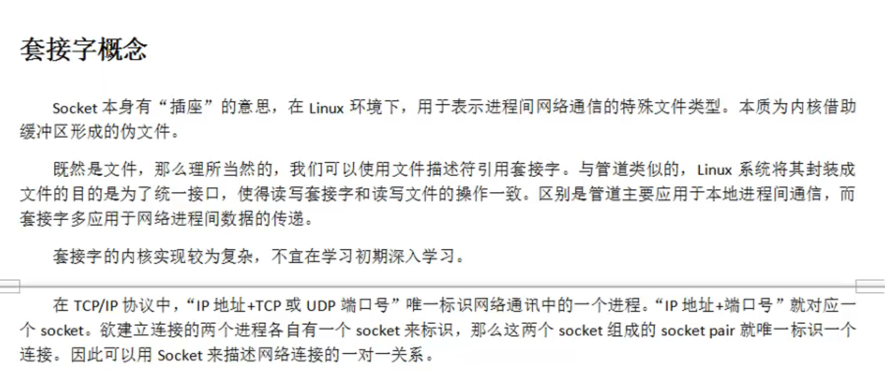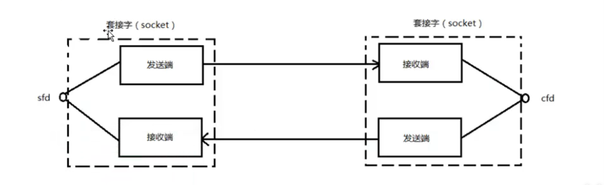

### 1.2 网络字节序

​	实际上就是对于同一个数字，其高位对应地址高位，和高位对应地址低位这两种不同的存储方式使得数据表现不同，因此对于要发送到网络上的数据需要转换，从网络上接收到的数据也要进行转换

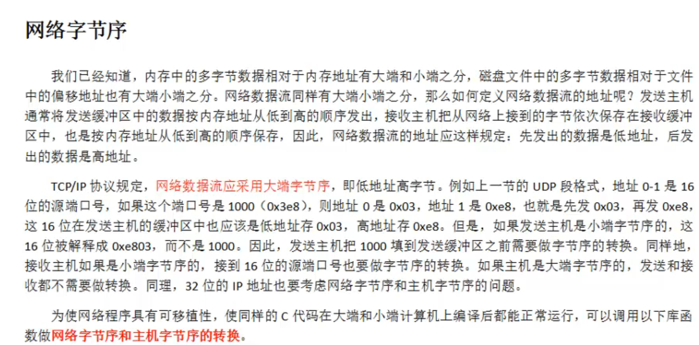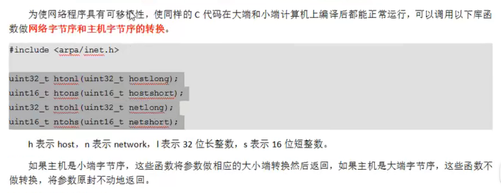

​	用户表示IP地址的方式叫点分十进制，例如 192.168.150.129，这样的形式在代码中属于字符串，但上面的htonl函数的参数是个uint32，所以要先将其转换为数字，再转换为网络字节序。 为了方便，Linux系统提供了inet_pton函数，有三个参数**第一个是af，表示使用ipv4还是ipv6，用宏定义来选择；第二个是const char*类型，表示传入的ip地址字符串，第三个参数是void * 类型的，作为传出参数，表示转换好了的网络字节序**，使用这个函数可以一步到位，相应的，也有将网络字节序直接转换为字符串的inet_ntop

### 1.3 sockaddr结构体

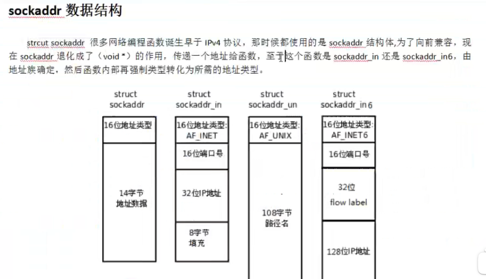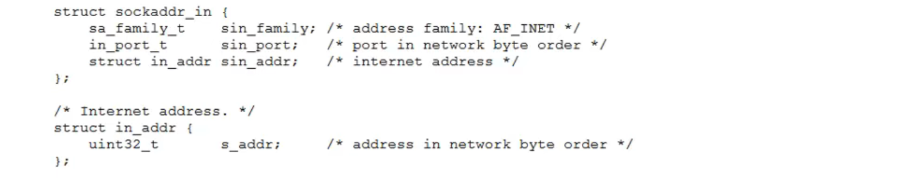

​	sockaddr是一个早期用于记录ipv4地址的数据结构，用于socket编程，后来演变为sockaddr_in，增加了端口号、地址类型等，但早期函数形参有一些是用的sockaddr，因此在使用的时候需要强制类型转换。

### 1.4 网络套接字函数

1. socket函数：用于创建套接字，成功返回套接字文件fd，失败返回-1。其中第二个参数，如果是SOCK_STREAM就默认是TCP，SOCK_DGRAM就默认是UDP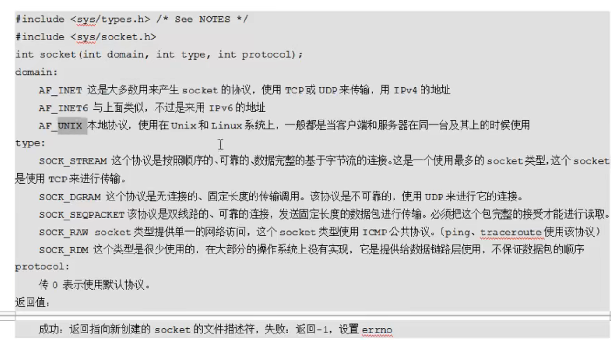

 	2. bind函数：用于将ip地址与套接字绑定，只有服务端需要调用这个函数，在客户端可以不必调用，但不代表没有绑定，不调用的话这个绑定的过程是操作系统完成的，它会自动分配一个ip地址，但服务端不可以用随意的ip，而应该用固定的，否则客户端找不到，因此必须用bind函数。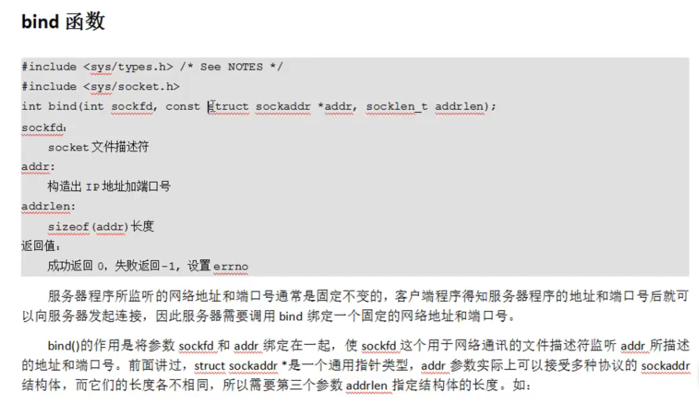
 	3. listen函数：用于设置最多有多少台设备可以服务，默认值128，只有服务端需要设置
     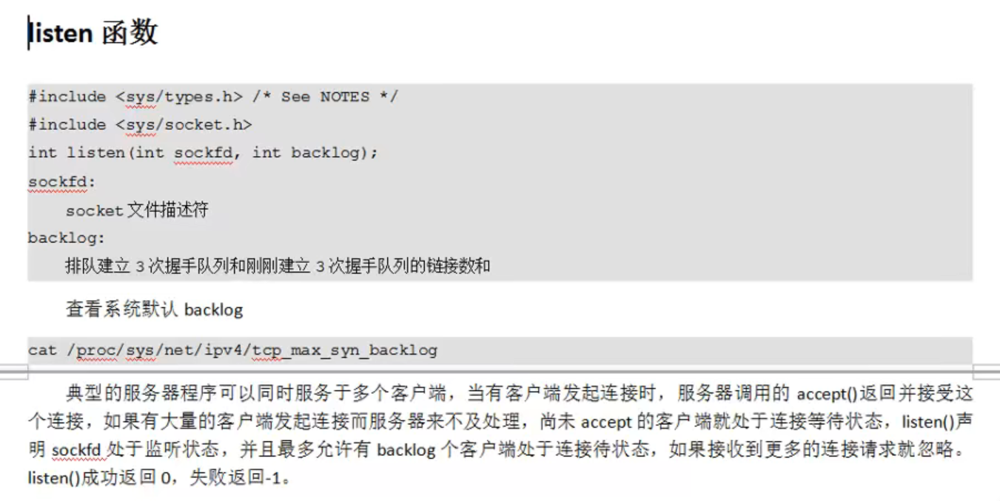
 	4. accept函数：服务端调用此函数阻塞等待客户端连接，注意它将返回一个新的socket文件用于和客户端连接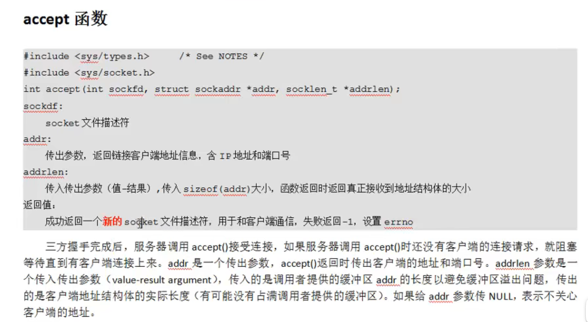

5.  setsockopt函数：设置socket属性，可用于设置端口复用：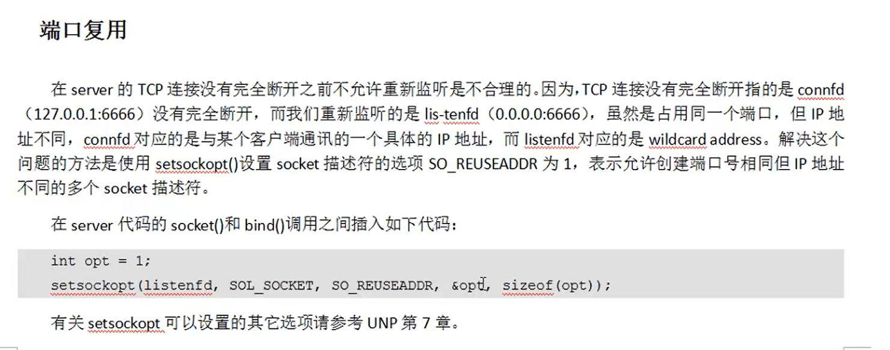

## 二、多路IO转接服务器

​	相当于让内核帮助服务端监听有无事件发生(例如有新用户要建立连接、已经建立了连接的用户要进行数据传输等)

### 2.1 poll函数

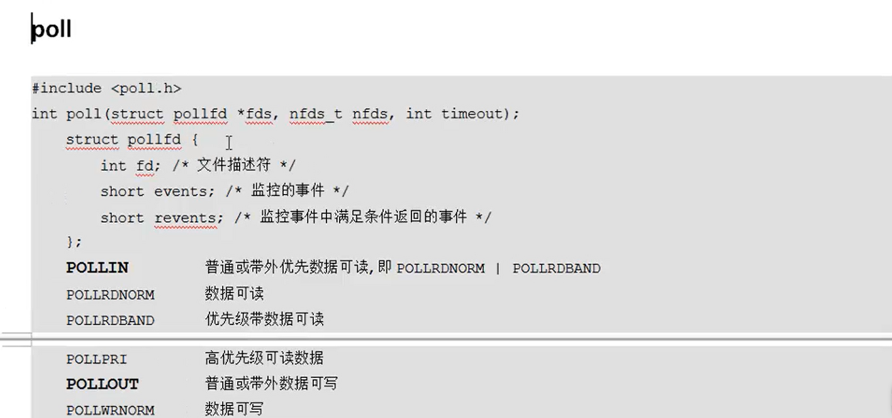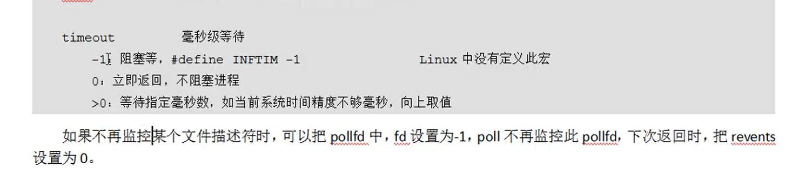
	参数一为指向结构体数组的指针，通过这个指针对结构体数组进行遍历，逐个查看对应的文件描述符是否有事件发生，例如可以将lfd作为0号元素，每当监听到0号元素有事件发生时，就代表有新的客户端向服务器发起连接请求。函数的返回值是发生的事件数。
	调用完poll函数，该如何确定哪个文件描述符对应发生了哪类事件呢，可以用结构体中的revents来确定，对于一个结构体，revents代表监控事件中满足条件返回的事件，也就是说只有同一结构体中event指定的那个事件(可能是读、写或者其它)发生时它它才会被操作系统赋值，此时用位与的方式来判断，例如 a.revents & POLLIN  ,这条语句可以判断结构体a对应的文件描述符有没有发生读事件。