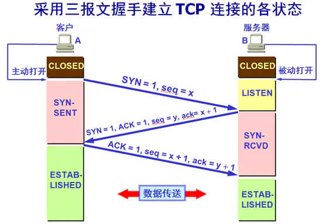
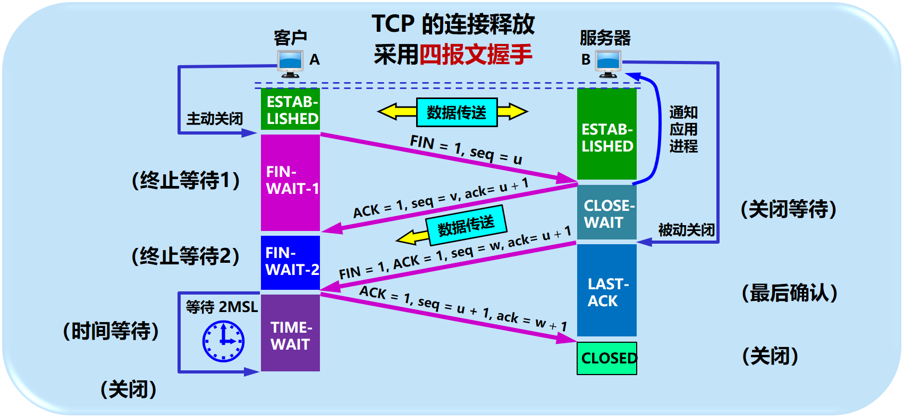
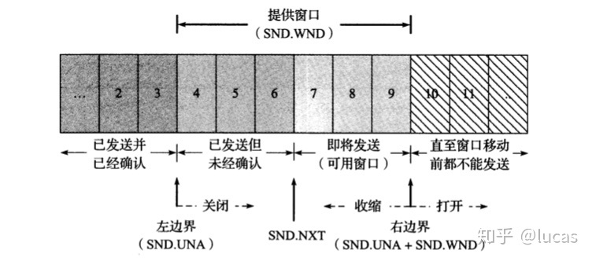
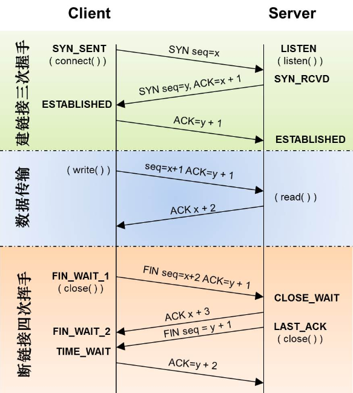

## TCP

## 一、TCP的特点及其目的

​	TCP的出现，可以解决数据破坏、丢包、重复以及分片顺序混乱的问题。TCP通过**检验和、序列号、确认应答、重发控制、连接管理以及窗口控制**等机制实现可靠性传输。

## 二、通过序列号与确认应答提高可靠性

​	首先是**确认应答**：发送端的数据发送到接收端后，接收端会返回一个已收到的通知消息，这个消息叫做确认应答(ACK)，只有收到确认应答，发送端才会继续发送下一份数据。这种确认应答的机制保证了可靠性传输，如果有确认应答，说明数据成功到达对端，反之，数据极有可能丢失。当主机A发送数据但未收到确认应答时，有**两种情况**：1. A发送的数据丢失，这种情况毕竟简单，一定时间后A再次发送数据即可。  2. B的确认应答丢失，这种情况下，A端会按照规则再次发送数据，但B端收到相同的数据后会丢弃它并再次发送确认应答。
​	其次是**序列号**：上述提到的确认应答、超时重传、重复控制等机制都是通过序列号实现的，序列号是**按发送顺序给发送数据的每一个自己都标上号码的编号**，接受端**查询接受数据TCP首部中的序列号和数据长度，将下一步应该接受的序列号作为确认应答返送回去**，例如收到了1~1000号的数据，下一次应该从1001号数据开始，那么确认应答就发送1001。
​	重发超时的确定方式：重发超时是指发送端未收到确认应答而重发数据的这段时间间隔，等待超出这段时间的话就重发数据，其计算方式为RTT+偏差再大一点的值。数据重发后若还是收不到应答，这个等待确认应答的时间将以2、4倍指数增长，重发一定次数后就判定网络或对方异常，强制关闭连接。

## 三、连接管理

​	TCP是面向连接的通信传输，面向连接是指在数据通信开始前先做好两端之间的准备工作。连接工作包括建立连接与释放连接。

### 3.1 建立连接：三次握手

​	三次握手指的是连接发起方与接受方之间需要发送三次报文才算建立TCP连接，其过程如下： 
​	首先A发送一个请求建立连接，顺便发送自己的序列号(由操作系统产生)，B收到后保存A的序列号，然后给A回一个ACK以及SYN，并发送自己的序列号给A，A收到后再回一个ACK，此时连接建立完毕。
​	注意：三报文握手的本质是**交换彼此的序列号**，序列号是TCP可靠性传输的重要保证之一。那么为什么要三次握手，能不能是两次或四次呢？首先，如果是两次，B收到A的SYN后，双方对A的序列号都一致，但B给A回的，放有B的序列号的报文不一定能够送达，此时如果没有第三次报文发送，就无法确保双方都知道对方的序列号。而如果是四次：A发SYN及其序列号，B回ACK，B发SYN及其序列号，A回ACK，很明显第二步和第三步可以合并，因此三报文握手最合适。

### 3.2 切断连接：四次挥手

​	四次挥手是指断开连接发起方与接受方之间需要四次报文传输才算断开TCP连接，其过程如下： 
​	首先A发送一个FIN(请求切断连接)，B收到后回复ACK作为确认应答，但此时有可能**B端还未完成数据发送，因此会将数据发送完毕后再给A发送一个FIN，请求断开连接**，A收到了这个FIN后进入TIME-WAIT状态，等待2MSL后才close，同时在收到FIN时**立即**给B回一个ACK，B收到ACK后立刻关闭。为什么要有这个2MSL的等待呢？是因为怕A的最后一个ACK报文在传输过程中丢失，导致B收不到ACK的话会一直给A发送FIN，而此时如果A没有等，直接关闭，B就会一直发，导致资源的浪费。

 ## 四、TCP的滑动窗口及其控制

​	首先需要知道：**TCP是以段为单位发送数据**。在建立TCP连接的同时，双方确认发送数据报的单位，也称作**最大消息长度MSS**，TCP在传送大量数据时，是以MSS的大小将数据进行分割发送。
​	TCP如果以一个段为单位进行单次的发送与确认应答，则效率会很受RTT影响，因此TCP引入窗口的概念。当确认应答不是以每个分段，而是以更大的单位进行确认时，转发时间会大幅缩短，而窗口大小是指**无需等待确认应答而可以继续发送数据的最大值**。 

​	在收到确认应答的情况下，将窗口滑动到收到确认应答中的序列号的位置，这样可以顺序将多个段同时发送提高性能。例如：现在窗口发送了1~1000、1001~2000、2001~3000、3001~4000，而对端应该回复的确认应答应该包括下一次发送的数据的起始序列号：回复1001、2001、3001、4001，但假设第二、第三个回复丢失，若是不用窗口，则会重新发送，但现在收到了4001，则可以确定对端收到了前三个数据，所以可以将窗口位置调整至4001位置。如此一来，**某些应答丢失也不会导致数据重传**
​	那么假如数据真的丢失了呢？假设现在发送1~1000、1001~2000、2001~3000、3001~4000、4001~5000，假设第二个数据包，也就是1001~2000丢失，那么对端收到的数据包括1~1000、2001~3000，3001~4000、4001~5000，发现顺序有问题后，会一直给发送端返回ACK，**但其中的起始序列号为1001，当发送方连续收到三次同一序列号的应答后，会将对应的数据再次发送，而原先发送的那些数据报，接收端并没有丢弃，因此收到1001~2000后，下一个ACK的起始序列号为5001！** 

### 4.1 流控制

​	TCP提供一种机制来让发送端根据接收端的实际接收能力发送数据，在TCP首部中，专门有一个字段用于通知窗口大小，接收方根据可以接收的缓冲区大小来填写这个字段，而这也决定了滑动窗口的大小。
​	当接收方恢复接收能力时，会发送窗口更新通知，同时发送方也会定期发送一个窗口探测的数据段，防止窗口更新通知丢失。

### 4.2 拥塞控制

​	所谓拥塞控制就是防止过多的数据注入到网络中，这样可以使网络中的路由器或链路不至于过载。TCP进行拥塞控制的算法有四种：慢开始、拥塞避免、快重传、快恢复。

1.  慢开始：由小到大地增加注入到网络中的数据字节，也就是由小到大地增加拥塞窗口数值。例如一开始规定cwnd=1，每收到一个确认应答就加1，第一次接收就变成2，第二次由于发送了两个，再接收两个就变成4，依次类推。
  2.  拥塞避免：设置一个慢开始门限ssthresh，当cwnd<ssthresh时，使用第一点的慢算法，当cwnd>=ssthresh时，每经过一个RTT拥塞窗口增加1而不是成倍增长。当网络中出现超时时，就代表网络开始发生拥塞，调整门限值为cwnd/2，再将cwnd设置为1，执行慢开始算法
  3.  快重传：为了让发送方尽早知道个别报文段的丢失，要求接收方立即发送确认，按照快重传算法规定，一旦发送方一连收到3个重复确认，就知道现在并未出现网络拥塞，并立即重传丢失报文段。
  4.  快恢复：当发送端一连收到三个重复的确认，就知道未发生网络拥塞，因此不执行慢开始算法，执行快恢复算法。设置慢开始门限=当前cwnd/2，cwnd设置为新的慢开始门限，然后开始执行拥塞避免算法。

## 五、TCP状态图

  

## 六、TCP中提高网络利用率的规范

### 6.1 Nagle算法

​	该算法指的是：当发送端还有数据要发送，但要发送的数据比较小时，延时一段时间再发送。严谨的说法就是，只有满足以下两个条件的任意一个才发送数据： **1. 发送的数据均收到确认应答  2. 要发送的数据的长度为报文最大长度**。
​	虽然Nagle可以提高利用率，但是会造成一定程度的延时，某些领域(如自动化控制)如果用到TCP，一般会关闭它。

### 6.2 延时确认应答

​	假设接收端每次收到数据都立即返回确认应答，由于此时缓冲区的数据还没处理，可能会返回一个较小的窗口长度，造成利用率下降，解决方法就是不立即返回确认应答，具体的规则如下：

	1. 收到2 X 最大报文长度的数据前不做确认应答(有的操作系统只要收到两个包就确认应答)
 	2. 延时0.5S(很多操作系统实际上是0.2S，因为0.5S可能会引起超时重传)再进行确认应答

由于TCP滑动窗口的存在，也确实没必要对每一个数据报进行一次应答。

### 6.3 捎带应答

​	在传输层之上的应用层，很多应用层软件也是有类似TCP这样的发送、应答机制，例如HTTP，请求报文往往会对应一个响应报文。将TCP的确认应答与这类响应一起发回给发送端的行为称为捎带应答。
​	不难发现，捎带应答的实现基础就是要开启延时确认应答

## 七、粘包与拆包

### 7.1 粘包

​	产生原因：TCP是面向字节流的传输方式，它是无法辨别发送的数据是否属于同一个包的，而如果多个数据包由一次TCP传输到接收端，接收端收到的那些数据就发送粘包现象。粘包发生的原因有多种：一个是接收端没来得及收，导致多个数据存放在socket缓冲区，一个是TCP发送端采用了类似Negal的提高网络利用率算法，导致多个数据包一次性发送，一个是单次要发送的数据包过大，TCP得将其拆分传输，第一次发了0.8个，第二次发了0.4个，就导致第一个包和第二个包黏在一起。举个例子：服务器分三次发送字符串abc，接收端由于某种原因，阻塞了一小段时间后才去读取socket缓冲区，于是读到的数据为abcabcabc，此时就发生了三个数据包黏在一起的现象。

​	解决方法：TCP只保证将数据以字节流的形式发送，并且不会乱序，但如何将字节流整理成数据包是使用TCP的那一方的事情，因此解决粘包问题实际上是应用层协议应该考虑的都行，具体几种方法如下：

1.  设置数据包定长：通过接收固定长度的数据包来分辨缓冲区中的数据所属

 	2. 增加消息头：类似HTTP的首部字段，这个消息头起码要指出当前数据包的长度
 	3. 在尾部添加特定分割标志：通过尾部标志辨别数据所属的数据包
 	4. 添加消息头和消息尾

### 7.2 拆包

​	产生原因：要发送的数据包超过TCP最大报文长度，就会将当前数据包分成多个TCP报文进行传输。

补充：最大报文段长度MSS：在建立TCP连接时，双方商定的所能接收的最大报文长度，不包括报文头

## 八、半连接队列和全连接队列

### 8.1 概念

​	在TCP三次握手时，Linux系统内核维护两个关于TCP连接的队列，**SYN队列称为半连接队列**，当客户端发送SYN时，系统将该连接放入半连接队列然后返回一个ACK+SYN。**accept队列称为全连接队列**，当收到客户端返回的ACK报文时，将连接从半连接队列中取出，并将全新的连接放入全连接队列中，**等待服务端调用accept函数，然后再将连接取出**
 
半连接队列和全连接队列都有长度限制，超出其限制时会将新的连接丢弃或返回RST报文。

 