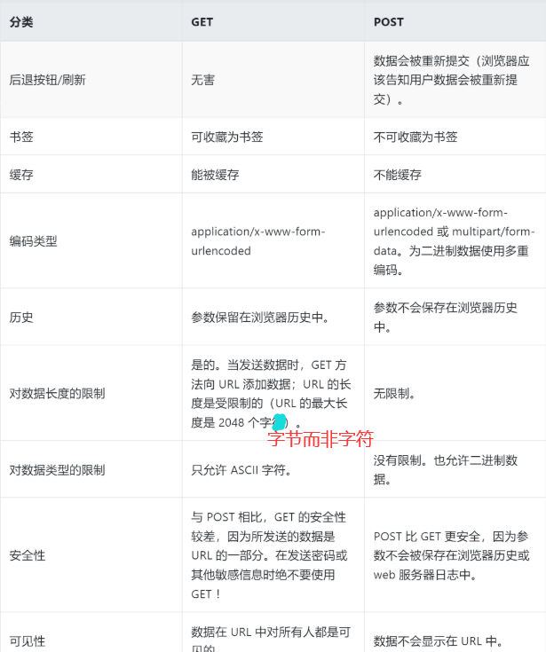
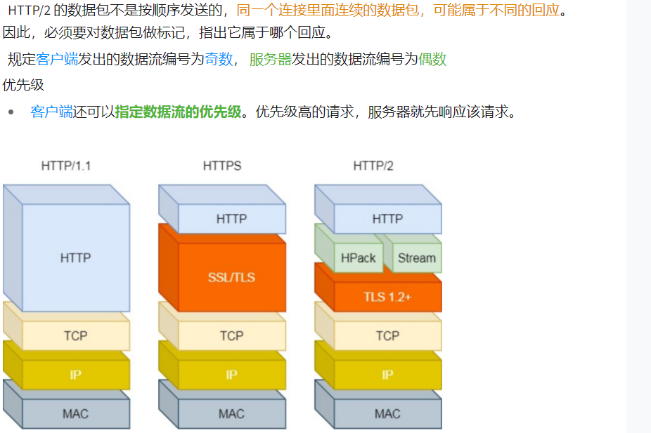

## HTTP

### 1. HTTP状态码

1XX : 表示请求已被服务器处理，需要请求方进一步操作。

1. 100 continue：继续。客户端应继续其请求。

 	2. 101  Switching Protocols：更换协议。服务器根据客户端的请求跟换协议，只能更换更高级的协议。 

2XX: 成功，请求被服务器收到且正常处理。

1.  200 OK: 请求成功，一般用于GET POST。

 	2. 201 Create：资源已创建。
 	3. 202 ： Accept：已接受请求，但处理未完成
            	4. No content :  无内容。服务器成功处理，但未返回内容。

3XX: 重定向，需要进一步的操作完成请求

1.  300：Multiple Choices   多重选择。请求的资源位于多个位置，响应可返回一个资源特征与位置的列表供客户端选择
2.  301：Move Permanently 请求的资源已被**永久**移动到新URL，响应报文中的Location指明了新的URL
3.  302：Found  临时重定向。说明请求的资源还在，但暂时需要另一个URL访问
4.  306：Unused    已经被废弃的HTTP状态码。

4XX : 客户端错误，请求包含语法错误或无法完成请求

1.  400：Bad Request  客户端的请求包含语法错误
2.  401：Unauthorized  请求要求用户身份认证
3.  403 Forbidden：服务端拒绝客户端的资源请求
4.  404 Not Found：服务器无法根据客户端的请求找到资源

5XX：服务器错误，服务器在处理请求的过程中发生了错误

1.  500 Internal Server Error 通用服务器错误
2.  505 Bad Gateway 只有HTTP代理会发送这个响应代码。通常是服务器作为网关或代理时返回的错误码，表示服务器自身工作正常，只是下一级服务器发生错误。

### 2. GET和POST的区别

  

补充：GET将请求放在URL中，每次只发送一个包。而POST会先发送请求头，服务器回复100 continue之后再发送data，服务器响应200并返回数据。

### 3. cookie和session的区别

​	HTTP是面向无状态的协议，但难免会有需要记录用户数据的需求，cookie和session就是用来实现这一功能的。

1.  存储位置：cookie存储在浏览器内，session存储在服务器中
2.  安全性：cookie明文存储，不安全。session只用cookie中的sessionId来找到用户信息，真正的用户信息存储在服务器中，难以被其它人获取或伪造。
3.  对服务器的影响：客户多了之后session占用较大的服务器内存
4.  数据大小：单个cooki保存的数据一般不超过4K，浏览器会限制站点保存20个cookie最多。

### 4. HTTP1.0和1.1的区别

1. 长连接：也即keep-alive首部。1.0默认使用短连接，也可通过首部行设置长连接。1.1默认长连接

 	2. 断点续传：1.0只会传输整个数据实体，没办法部分传输。1.1默认支持断点续传，只需在请求报文首部字段中加入Range字段，用来表示客户希望从何处开始下载。
 	3. 节约带宽：1.1支持只发送header信息，服务器认为客户端有权限请求数据时才返回100，客户端收到100才把body发送给服务器
 	4. 管线化传输：对于HTTP请求和响应，1.1不需要等待到响应后再发送请求，而是在响应到来前可以发送其它请求，当然响应的顺序是不变的(类似TCP滑动窗口)

### 5. HTTP1.1和2.0的区别

1.  多路复用：在处理并发连接的问题上，1.1采取多个TCP连接处理多个并发请求的方式，但创建TCP连接是有开销的。而2.0采用多路复用技术，一个连接可以处理多个并发请求。例如服务器接收到客户端的A请求和B请求，其中A请求处理较耗时间，可以先返回A的一部分然后处理B。
    详解：https://www.cnblogs.com/cmyoung/p/14604135.html

2.  数据格式：1.1的报文使用的是文本格式，2.0使用二进制格式，头部和数据体都是二进制格式，并且统称为帧。这样的好处是计算机可以直接解析二进制报文，处理速度快。

    

3.  服务器推送：1.1中资源必须由客户端请求，而2.0中允许服务端推送资源给客户端，下次客户端要用这些资源就可以直接从本地获取，无需建立网络连接。

## HTTPS

​	http都是明文传输，如果传输设备被监听，就会导致数据泄漏而引发安全问题。HTTPS就是将HTTP数据包通过SSL加密后传输。**http的端口是80，而https的端口是443**。

### 1. 对称加密和非对称加密

​	对称加密：使用同一个密钥进行加密和解密。
​	非对称加密：用公钥加密，私钥解密
最佳的加密解密方案是：对称加密+非对称加密。核心思想是，服务器与客户端之间的报文用对称解密，而对称加密的密钥使用非对称加密传输，其流程如下：

1. 服务端持有非对称加密的公钥A1、私钥A2

 	2. 客户端发送请求后，服务器返回A1给客户端
 	3. 客户端生成对称加密的密钥K，并用A1加密K，发送给服务器
 	4. 服务器用私钥A2解密出K
 	5. 然后双方读取对方的报文都使用密钥K

### 2. HTTPS与HTTP的区别

1.  端口号：Http是80，Https是443
2.  HTTPS需要向证书权威机构申请数字证书，来保证服务器的身份是可信的
3.  建立连接：HTTP只需TCP三次握手建立连接，而HTTPS在此基础上还需要进行SSL的握手过程才能进入加密报文传输。

## TCP

### 1. TCP粘包和拆包

​	粘包：在发送数据时，发送端一次性发送多个数据报，TCP将这多个数据包整合到一个报文段中进行发送。
​	拆包：发送端要发送的数据包长度大于TCP最大报文长度，TCP会将数据包分成多个报文发送
粘包和拆包如何实现：

1. 设置消息定长

 	2. 头部添加消息长度
 	3. 消息尾部添加特殊字符进行分割
 	4. 将消息分为消息头和消息尾

### 2. 键入URL后发生了什么

1.  解析URL
2.  生成HTTP请求报文
3.  DNS解析：通过URL解析到目的IP
4.  浏览器与WEB服务器建立TCP连接
5.  浏览器向HTTP服务器发送相应的HTTP请求报文
6.  服务器响应，回复数据或错误错误信息
7.  浏览器下载响应报文并解析HTML文件，渲染到页面中。

### 3. OSI七层模型

​	从上至下分别是：应用层、表示层、会话层、传输层、网络层、数据链路层、物理层。
如果是五层模型：应用层、传输层、网络层、数据链路层、物理层